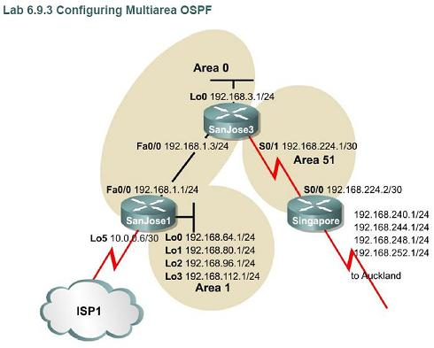

configuring multiarea ospf

objective:

configure multiarea OSPF operation, interarea summarization, external route summarization and default routing.

topology:

configs:

SanJose3:

SanJose3#sh run Building configuration...

Current configuration : 1729 bytes ! version 12.4 service timestamps debug datetime msec service timestamps log datetime msec no service password-encryption ! hostname SanJose3 ! boot-start-marker boot-end-marker ! enable secret 5 $1$ypAG$EbdmRvrpwemBIcVcmu75b/ ! no aaa new-model ! resource policy ! ip cef ! ! interface Loopback0 ip address 192.168.3.1 255.255.255.0 ! interface FastEthernet0/0 ip address 192.168.1.3 255.255.255.0 duplex half ! interface Serial1/0 ip address 192.168.224.1 255.255.255.252 serial restart-delay 0 no dce-terminal-timing-enable ! interface Serial1/1 no ip address shutdown serial restart-delay 0 no dce-terminal-timing-enable ! interface Serial1/2 no ip address shutdown serial restart-delay 0 no dce-terminal-timing-enable ! interface Serial1/3 no ip address shutdown serial restart-delay 0 no dce-terminal-timing-enable ! interface Serial1/4 no ip address shutdown serial restart-delay 0 no dce-terminal-timing-enable ! interface Serial1/5 no ip address shutdown serial restart-delay 0 no dce-terminal-timing-enable ! interface Serial1/6 no ip address shutdown serial restart-delay 0 no dce-terminal-timing-enable ! interface Serial1/7 no ip address shutdown serial restart-delay 0 no dce-terminal-timing-enable ! router ospf 1 log-adjacency-changes network 192.168.1.0 0.0.0.255 area 0 network 192.168.3.0 0.0.0.255 area 0 network 192.168.224.0 0.0.0.3 area 51 ! no ip http server no ip http secure-server ! ! ! logging alarm informational ! ! ! ! ! ! control-plane ! ! ! ! ! ! gatekeeper shutdown ! ! line con 0 exec-timeout 0 0 password cisco logging synchronous login stopbits 1 line aux 0 stopbits 1 line vty 0 4 login ! ! end

SanJose3#

Singapore:

Singapore#sh run Building configuration...

Current configuration : 1833 bytes ! version 12.4 service timestamps debug datetime msec service timestamps log datetime msec no service password-encryption ! hostname Singapore ! boot-start-marker boot-end-marker ! enable secret 5 $1$AQ32$aPkEbUAsrR/1PajuOSNtq/ ! no aaa new-model ! resource policy ! ip cef ! ! ! interface FastEthernet0/0 no ip address shutdown duplex half ! interface Serial1/0 ip address 192.168.224.2 255.255.255.252 serial restart-delay 0 no dce-terminal-timing-enable ! interface Serial1/1 no ip address shutdown serial restart-delay 0 no dce-terminal-timing-enable ! interface Serial1/2 no ip address shutdown serial restart-delay 0 no dce-terminal-timing-enable ! interface Serial1/3 no ip address shutdown serial restart-delay 0 no dce-terminal-timing-enable ! interface Serial1/4 no ip address shutdown serial restart-delay 0 no dce-terminal-timing-enable ! interface Serial1/5 no ip address shutdown serial restart-delay 0 no dce-terminal-timing-enable ! interface Serial1/6 no ip address shutdown serial restart-delay 0 no dce-terminal-timing-enable ! interface Serial1/7 no ip address shutdown serial restart-delay 0 no dce-terminal-timing-enable ! router ospf 1 log-adjacency-changes summary-address 192.148.240.0 255.255.240.0 (external route summarization) redistribute static metric-type 1 (external route summarization using E1 type 5 LSA) network 192.168.224.0 0.0.0.3 area 51 ! ip route 192.168.240.0 255.255.255.0 Null0 ip route 192.168.244.0 255.255.255.0 Null0 ip route 192.168.248.0 255.255.255.0 Null0 ip route 192.168.252.0 255.255.255.0 Null0 no ip http server no ip http secure-server ! ! ! logging alarm informational ! ! ! ! ! ! control-plane ! ! ! ! ! ! gatekeeper shutdown ! ! line con 0 exec-timeout 0 0 password cisco logging synchronous login stopbits 1 line aux 0 stopbits 1 line vty 0 4 login ! ! end

Singapore#

SanJose1:

SanJose1#sh run Building configuration...

Current configuration : 1237 bytes ! version 12.4 service timestamps debug datetime msec service timestamps log datetime msec no service password-encryption ! hostname SanJose1 ! boot-start-marker boot-end-marker ! enable secret 5 $1$ocFL$HKIOiot107PO6H3IDYjIV0 ! no aaa new-model ! resource policy ! ip cef ! ! ! ! ! ! ! ! ! ! ! ! ! ! ! ! ! ! ! ! ! ! ! ! ! ! interface Loopback0 ip address 192.168.64.1 255.255.255.0 ! interface Loopback1 ip address 192.168.80.1 255.255.255.0 ! interface Loopback2 ip address 192.168.96.1 255.255.255.0 ! interface Loopback3 ip address 192.168.112.1 255.255.255.0 ! interface Loopback5 ip address 10.0.0.6 255.255.255.252 ! interface FastEthernet0/0 ip address 192.168.1.1 255.255.255.0 duplex half ! router ospf 1 log-adjacency-changes area 1 range 192.168.64.0 255.255.192.0 (interarea summarization) network 192.168.1.0 0.0.0.255 area 0 network 192.168.64.0 0.0.63.255 area 1 default-information originate always (distribute default routing information) ! no ip http server no ip http secure-server ! ! ! logging alarm informational ! ! ! ! ! ! control-plane ! ! ! ! ! ! gatekeeper shutdown ! ! line con 0 exec-timeout 0 0 password cisco logging synchronous login stopbits 1 line aux 0 stopbits 1 line vty 0 4 exec-timeout 0 0 password cisco logging synchronous login ! ! end

SanJose1#

summary:

- Router SanJose1is an ABR and ASBR (do sh ip ospf)
- Router SanJose3 is an ABR (do sh ip ospf)
- Router Singapore is an ASBR (do sh ip ospf)
- Type 5 LSA used to redistribute external routes. E2 type 5 LSA doesn't count internal OSPF AS metric. E1 type 5 LSA count internal OSPF AS metric. So, when there are more than one link to external network, use E1 type 5 LSA do redistribute static metric-type 1 on router configuration mode.
- To distribute default routing information for other OSPF area to a specific router, do default-information originate always on that router. This will distribute Gateway of last resort to other routers to this specific router. PS: this router must be the only way out for other routers to the internet.
