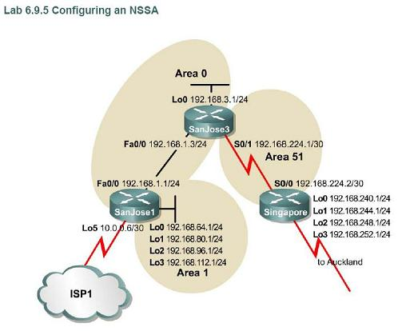

configuring ospf nssa

Obejctive:

configure OSPF NSSA in order to import external routing information while retaining the benefits of a stub area.

you want to make Singapore router has routing table entry as least as possible because this router only has one way out to the ISP1 via router SanJose3. you can realize this by configuring area 51 as a stub or totally stubby area, but the Auckland network will not being advertised through the other areas, remember stub and totally stubby area filter type 5 LSA. so with stub or totally stubby configuration, we can't ping Auckland network (192.168.240.1 for example) from router SanJose 1.in this case Singapore is an ASBR. an ASBR can not be a stub router.

the solution for this situation is to configure the area 51 as NSSA. with NSSA we can filter type 5 LSAs. by using NSSA with no-summary, we can filter both type 5 and type 3/4 LSAs, and the Auckland network will still being advertised using type 7 LSA. an amazing example of cisco propietary protocol.

Topology:

Configs:

NSSA Configs

SanJose3#sh run Building configuration...

Current configuration : 1743 bytes ! version 12.4 service timestamps debug datetime msec service timestamps log datetime msec no service password-encryption ! hostname SanJose3 ! boot-start-marker boot-end-marker ! enable secret 5 $1$ypAG$EbdmRvrpwemBIcVcmu75b/ ! no aaa new-model ! resource policy ! ip cef ! ! ! ! ! ! ! ! ! ! ! ! ! ! ! ! ! ! ! ! ! ! ! ! ! ! interface Loopback0 ip address 192.168.3.1 255.255.255.0 ! interface FastEthernet0/0 ip address 192.168.1.3 255.255.255.0 duplex half ! interface Serial1/0 ip address 192.168.224.1 255.255.255.252 serial restart-delay 0 no dce-terminal-timing-enable ! interface Serial1/1 no ip address shutdown serial restart-delay 0 no dce-terminal-timing-enable ! interface Serial1/2 no ip address shutdown serial restart-delay 0 no dce-terminal-timing-enable ! interface Serial1/3 no ip address shutdown serial restart-delay 0 no dce-terminal-timing-enable ! interface Serial1/4 no ip address shutdown serial restart-delay 0 no dce-terminal-timing-enable ! interface Serial1/5 no ip address shutdown serial restart-delay 0 no dce-terminal-timing-enable ! interface Serial1/6 no ip address shutdown serial restart-delay 0 no dce-terminal-timing-enable ! interface Serial1/7 no ip address shutdown serial restart-delay 0 no dce-terminal-timing-enable ! router ospf 1 log-adjacency-changes area 51 nssa (configure area 51 as nssa) network 192.168.1.0 0.0.0.255 area 0 network 192.168.3.0 0.0.0.255 area 0 network 192.168.224.0 0.0.0.3 area 51 ! no ip http server no ip http secure-server ! ! ! logging alarm informational ! ! ! ! ! ! control-plane ! ! ! ! ! ! gatekeeper shutdown ! ! line con 0 exec-timeout 0 0 password cisco logging synchronous login stopbits 1 line aux 0 stopbits 1 line vty 0 4 login ! ! end

SanJose3#

Singapore#sh run Building configuration...

Current configuration : 1867 bytes ! version 12.4 service timestamps debug datetime msec service timestamps log datetime msec no service password-encryption ! hostname Singapore ! boot-start-marker boot-end-marker ! enable secret 5 $1$AQ32$aPkEbUAsrR/1PajuOSNtq/ ! no aaa new-model ! resource policy ! ip cef ! ! ! ! ! ! ! ! ! ! ! ! ! ! ! ! ! ! ! ! ! ! ! ! ! ! interface Loopback0 ip address 192.168.240.1 255.255.255.0 ! interface Loopback1 ip address 192.168.244.1 255.255.255.0 ! interface Loopback2 ip address 192.168.248.1 255.255.255.0 ! interface Loopback3 ip address 192.168.252.1 255.255.255.0 ! interface FastEthernet0/0 no ip address shutdown duplex half ! interface Serial1/0 ip address 192.168.224.2 255.255.255.252 serial restart-delay 0 no dce-terminal-timing-enable ! interface Serial1/1 no ip address shutdown serial restart-delay 0 no dce-terminal-timing-enable ! interface Serial1/2 no ip address shutdown serial restart-delay 0 no dce-terminal-timing-enable ! interface Serial1/3 no ip address shutdown serial restart-delay 0 no dce-terminal-timing-enable ! interface Serial1/4 no ip address shutdown serial restart-delay 0 no dce-terminal-timing-enable ! interface Serial1/5 no ip address shutdown serial restart-delay 0 no dce-terminal-timing-enable ! interface Serial1/6 no ip address shutdown serial restart-delay 0 no dce-terminal-timing-enable ! interface Serial1/7 no ip address shutdown serial restart-delay 0 no dce-terminal-timing-enable ! router ospf 1 log-adjacency-changes area 51 nssa (configure area 51 as nssa) redistribute connected (this will be distributed using type 7 LSA, not type 5) network 192.168.224.0 0.0.0.3 area 51 ! no ip http server no ip http secure-server ! ! ! logging alarm informational ! ! ! ! ! ! control-plane ! ! ! ! ! ! gatekeeper shutdown ! ! line con 0 exec-timeout 0 0 password cisco logging synchronous login stopbits 1 line aux 0 stopbits 1 line vty 0 4 login ! ! end

Singapore#

SanJose1#sh run Building configuration...

Current configuration : 1189 bytes ! version 12.4 service timestamps debug datetime msec service timestamps log datetime msec no service password-encryption ! hostname SanJose1 ! boot-start-marker boot-end-marker ! enable secret 5 $1$ocFL$HKIOiot107PO6H3IDYjIV0 ! no aaa new-model ! resource policy ! ip cef ! ! ! ! ! ! ! ! ! ! ! ! ! ! ! ! ! ! ! ! ! ! ! ! ! ! interface Loopback0 ip address 192.168.64.1 255.255.255.0 ! interface Loopback1 ip address 192.168.80.1 255.255.255.0 ! interface Loopback2 ip address 192.168.96.1 255.255.255.0 ! interface Loopback3 ip address 192.168.112.1 255.255.255.0 ! interface Loopback5 ip address 10.0.0.6 255.255.255.252 ! interface FastEthernet0/0 ip address 192.168.1.1 255.255.255.0 duplex half ! router ospf 1 log-adjacency-changes network 192.168.1.0 0.0.0.255 area 0 network 192.168.64.0 0.0.63.255 area 1 ! no ip http server no ip http secure-server ! ! ! logging alarm informational ! ! ! ! ! ! control-plane ! ! ! ! ! ! gatekeeper shutdown ! ! line con 0 exec-timeout 0 0 password cisco logging synchronous login stopbits 1 line aux 0 stopbits 1 line vty 0 4 exec-timeout 0 0 password cisco logging synchronous login ! ! end

SanJose1#

Result:

SanJose3#sh ip route Codes: C - connected, S - static, R - RIP, M - mobile, B - BGP D - EIGRP, EX - EIGRP external, O - OSPF, IA - OSPF inter area N1 - OSPF NSSA external type 1, N2 - OSPF NSSA external type 2 E1 - OSPF external type 1, E2 - OSPF external type 2 i - IS-IS, su - IS-IS summary, L1 - IS-IS level-1, L2 - IS-IS level-2 ia - IS-IS inter area, \* - candidate default, U - per-user static route o - ODR, P - periodic downloaded static route

Gateway of last resort is not set

192.168.224.0/30 is subnetted, 1 subnets C 192.168.224.0 is directly connected, Serial1/0 O N2 192.168.240.0/24 \[110/20\] via 192.168.224.2, 00:02:12, Serial1/0 O N2 192.168.244.0/24 \[110/20\] via 192.168.224.2, 00:02:12, Serial1/0 192.168.64.0/32 is subnetted, 1 subnets O IA 192.168.64.1 \[110/2\] via 192.168.1.1, 00:02:12, FastEthernet0/0 192.168.80.0/32 is subnetted, 1 subnets O IA 192.168.80.1 \[110/2\] via 192.168.1.1, 00:02:12, FastEthernet0/0 192.168.96.0/32 is subnetted, 1 subnets O IA 192.168.96.1 \[110/2\] via 192.168.1.1, 00:02:12, FastEthernet0/0 O N2 192.168.248.0/24 \[110/20\] via 192.168.224.2, 00:02:12, Serial1/0 192.168.112.0/32 is subnetted, 1 subnets O IA 192.168.112.1 \[110/2\] via 192.168.1.1, 00:02:12, FastEthernet0/0 C 192.168.1.0/24 is directly connected, FastEthernet0/0 O N2 192.168.252.0/24 \[110/20\] via 192.168.224.2, 00:02:14, Serial1/0 C 192.168.3.0/24 is directly connected, Loopback0 SanJose3#sh ip ospf dat

OSPF Router with ID (192.168.3.1) (Process ID 1)

Router Link States (Area 0)

Link ID ADV Router Age Seq# Checksum Link count 192.168.3.1 192.168.3.1 662 0x80000007 0x0045B2 2 192.168.112.1 192.168.112.1 217 0x80000007 0x001689 1

Net Link States (Area 0)

Link ID ADV Router Age Seq# Checksum 192.168.1.1 192.168.112.1 1475 0x80000005 0x00990E

Summary Net Link States (Area 0)

Link ID ADV Router Age Seq# Checksum 192.168.64.1 192.168.112.1 1475 0x80000005 0x00E7CA 192.168.80.1 192.168.112.1 1475 0x80000005 0x00376B 192.168.96.1 192.168.112.1 1475 0x80000005 0x00860C 192.168.112.1 192.168.112.1 1475 0x80000005 0x00D5AC 192.168.224.0 192.168.3.1 1416 0x80000005 0x006FD4

Router Link States (Area 51)

Link ID ADV Router Age Seq# Checksum Link count 192.168.3.1 192.168.3.1 662 0x80000008 0x00A51A 2 192.168.252.1 192.168.252.1 654 0x80000008 0x005372 2

Summary Net Link States (Area 51)

Link ID ADV Router Age Seq# Checksum 192.168.1.0 192.168.3.1 1332 0x80000001 0x005509 192.168.3.1 192.168.3.1 1332 0x80000001 0x003526 192.168.64.1 192.168.3.1 1332 0x80000001 0x009D7F 192.168.80.1 192.168.3.1 1332 0x80000001 0x00EC20 192.168.96.1 192.168.3.1 1332 0x80000001 0x003CC0 192.168.112.1 192.168.3.1 1332 0x80000001 0x008B61

Type-7 AS External Link States (Area 51)

Link ID ADV Router Age Seq# Checksum Tag 192.168.240.0 192.168.252.1 654 0x80000005 0x00F98A 0 192.168.244.0 192.168.252.1 654 0x80000005 0x00CDB2 0 192.168.248.0 192.168.252.1 654 0x80000005 0x00A1DA 0 192.168.252.0 192.168.252.1 654 0x80000005 0x007503 0

Type-5 AS External Link States

Link ID ADV Router Age Seq# Checksum Tag 192.168.240.0 192.168.3.1 663 0x80000005 0x006424 0 192.168.244.0 192.168.3.1 665 0x80000005 0x00384C 0 192.168.248.0 192.168.3.1 665 0x80000005 0x000C74 0 192.168.252.0 192.168.3.1 665 0x80000005 0x00DF9C 0 SanJose3#

Singapore#sh ip route Codes: C - connected, S - static, R - RIP, M - mobile, B - BGP D - EIGRP, EX - EIGRP external, O - OSPF, IA - OSPF inter area N1 - OSPF NSSA external type 1, N2 - OSPF NSSA external type 2 E1 - OSPF external type 1, E2 - OSPF external type 2 i - IS-IS, su - IS-IS summary, L1 - IS-IS level-1, L2 - IS-IS level-2 ia - IS-IS inter area, \* - candidate default, U - per-user static route o - ODR, P - periodic downloaded static route

Gateway of last resort is not set

192.168.224.0/30 is subnetted, 1 subnets C 192.168.224.0 is directly connected, Serial1/0 C 192.168.240.0/24 is directly connected, Loopback0 C 192.168.244.0/24 is directly connected, Loopback1 192.168.64.0/32 is subnetted, 1 subnets O IA 192.168.64.1 \[110/66\] via 192.168.224.1, 00:00:19, Serial1/0 192.168.80.0/32 is subnetted, 1 subnets O IA 192.168.80.1 \[110/66\] via 192.168.224.1, 00:00:19, Serial1/0 192.168.96.0/32 is subnetted, 1 subnets O IA 192.168.96.1 \[110/66\] via 192.168.224.1, 00:00:19, Serial1/0 C 192.168.248.0/24 is directly connected, Loopback2 192.168.112.0/32 is subnetted, 1 subnets O IA 192.168.112.1 \[110/66\] via 192.168.224.1, 00:00:20, Serial1/0 O IA 192.168.1.0/24 \[110/65\] via 192.168.224.1, 00:00:20, Serial1/0 C 192.168.252.0/24 is directly connected, Loopback3 192.168.3.0/32 is subnetted, 1 subnets O IA 192.168.3.1 \[110/65\] via 192.168.224.1, 00:00:20, Serial1/0 Singapore#sh ip ospf dat

OSPF Router with ID (192.168.252.1) (Process ID 1)

Router Link States (Area 51)

Link ID ADV Router Age Seq# Checksum Link count 192.168.3.1 192.168.3.1 706 0x80000008 0x00A51A 2 192.168.252.1 192.168.252.1 696 0x80000008 0x005372 2

Summary Net Link States (Area 51)

Link ID ADV Router Age Seq# Checksum 192.168.1.0 192.168.3.1 1376 0x80000001 0x005509 192.168.3.1 192.168.3.1 1376 0x80000001 0x003526 192.168.64.1 192.168.3.1 1376 0x80000001 0x009D7F 192.168.80.1 192.168.3.1 1376 0x80000001 0x00EC20 192.168.96.1 192.168.3.1 1376 0x80000001 0x003CC0 192.168.112.1 192.168.3.1 1376 0x80000001 0x008B61

Type-7 AS External Link States (Area 51)

Link ID ADV Router Age Seq# Checksum Tag 192.168.240.0 192.168.252.1 696 0x80000005 0x00F98A 0 192.168.244.0 192.168.252.1 696 0x80000005 0x00CDB2 0 192.168.248.0 192.168.252.1 697 0x80000005 0x00A1DA 0 192.168.252.0 192.168.252.1 697 0x80000005 0x007503 0 Singapore#

SanJose1#sh ip route Codes: C - connected, S - static, R - RIP, M - mobile, B - BGP D - EIGRP, EX - EIGRP external, O - OSPF, IA - OSPF inter area N1 - OSPF NSSA external type 1, N2 - OSPF NSSA external type 2 E1 - OSPF external type 1, E2 - OSPF external type 2 i - IS-IS, su - IS-IS summary, L1 - IS-IS level-1, L2 - IS-IS level-2 ia - IS-IS inter area, \* - candidate default, U - per-user static route o - ODR, P - periodic downloaded static route

Gateway of last resort is not set

192.168.224.0/30 is subnetted, 1 subnets O IA 192.168.224.0 \[110/65\] via 192.168.1.3, 00:05:22, FastEthernet0/0 O E2 192.168.240.0/24 \[110/20\] via 192.168.1.3, 00:05:22, FastEthernet0/0 O E2 192.168.244.0/24 \[110/20\] via 192.168.1.3, 00:05:22, FastEthernet0/0 C 192.168.64.0/24 is directly connected, Loopback0 C 192.168.80.0/24 is directly connected, Loopback1 10.0.0.0/30 is subnetted, 1 subnets C 10.0.0.4 is directly connected, Loopback5 C 192.168.96.0/24 is directly connected, Loopback2 O E2 192.168.248.0/24 \[110/20\] via 192.168.1.3, 00:05:22, FastEthernet0/0 C 192.168.112.0/24 is directly connected, Loopback3 C 192.168.1.0/24 is directly connected, FastEthernet0/0 O E2 192.168.252.0/24 \[110/20\] via 192.168.1.3, 00:05:22, FastEthernet0/0 192.168.3.0/32 is subnetted, 1 subnets O 192.168.3.1 \[110/2\] via 192.168.1.3, 00:05:23, FastEthernet0/0 SanJose1#sh ip ospf dat

OSPF Router with ID (192.168.112.1) (Process ID 1)

Router Link States (Area 0)

Link ID ADV Router Age Seq# Checksum Link count 192.168.3.1 192.168.3.1 781 0x80000007 0x0045B2 2 192.168.112.1 192.168.112.1 335 0x80000007 0x001689 1

Net Link States (Area 0)

Link ID ADV Router Age Seq# Checksum 192.168.1.1 192.168.112.1 1593 0x80000005 0x00990E

Summary Net Link States (Area 0)

Link ID ADV Router Age Seq# Checksum 192.168.64.1 192.168.112.1 1593 0x80000005 0x00E7CA 192.168.80.1 192.168.112.1 1593 0x80000005 0x00376B 192.168.96.1 192.168.112.1 1593 0x80000005 0x00860C 192.168.112.1 192.168.112.1 1593 0x80000005 0x00D5AC 192.168.224.0 192.168.3.1 1536 0x80000005 0x006FD4

Router Link States (Area 1)

Link ID ADV Router Age Seq# Checksum Link count 192.168.112.1 192.168.112.1 335 0x80000006 0x0039FE 4

Summary Net Link States (Area 1)

Link ID ADV Router Age Seq# Checksum 192.168.1.0 192.168.112.1 1594 0x80000007 0x00A54B 192.168.3.1 192.168.112.1 1594 0x80000005 0x00935B 192.168.224.0 192.168.112.1 1594 0x80000005 0x007B5A

Summary ASB Link States (Area 1)

Link ID ADV Router Age Seq# Checksum 192.168.3.1 192.168.112.1 816 0x80000005 0x007B73

Type-5 AS External Link States

Link ID ADV Router Age Seq# Checksum Tag 192.168.240.0 192.168.3.1 782 0x80000005 0x006424 0 192.168.244.0 192.168.3.1 782 0x80000005 0x00384C 0 192.168.248.0 192.168.3.1 782 0x80000005 0x000C74 0 192.168.252.0 192.168.3.1 782 0x80000005 0x00DF9C 0 SanJose1#

summary:

1. the Auckland network ditributed to the ospf areas using type 7 LSA by Singapore router. because no-summary command is not used, there will be still O IA Inter Area routes (type 3 or 4 LSA) in Singapore's routing table. Singapore's link-state database contains type 7 LSA and there's no type 5 LSA.
2. router SanJose 3 is the NSSA ABR that converts type 7 LSA into type 5 LSA and distribute them to area backbone. therefore, SanJose3's routing table contains type 5 LSA and type7 LSA. in SanJose3 routing table there are N2 (NSSA type 2) routes learned from type 7 LSA being distributed by Singapore router.
3. router SanJose1 is unaware of the NSSA configuration in area 51. NSSA ABR, router SanJose3 has convert type 7 LSA into type 5 LSA. Auckland networks listed in SanJose1's routing table as type 5 LSA (E2). in SanJose1's link-state database there's only type 5 LSAs from SanJose3's converted type 7 LSAs.

NSSA no-summary Configs

everything is the same as above. the only difference is at NSSA ABR, the SanJose3 router. we should add this following line.

router ospf 1 log-adjacency-changes area 51 nssa no-summary network 192.168.1.0 0.0.0.255 area 0 network 192.168.3.0 0.0.0.255 area 0 network 192.168.224.0 0.0.0.3 area 51

Result:

Singapore#sh ip route Codes: C - connected, S - static, R - RIP, M - mobile, B - BGP D - EIGRP, EX - EIGRP external, O - OSPF, IA - OSPF inter area N1 - OSPF NSSA external type 1, N2 - OSPF NSSA external type 2 E1 - OSPF external type 1, E2 - OSPF external type 2 i - IS-IS, su - IS-IS summary, L1 - IS-IS level-1, L2 - IS-IS level-2 ia - IS-IS inter area, \* - candidate default, U - per-user static route o - ODR, P - periodic downloaded static route

Gateway of last resort is 192.168.224.1 to network 0.0.0.0

192.168.224.0/30 is subnetted, 1 subnets C 192.168.224.0 is directly connected, Serial1/0 C 192.168.240.0/24 is directly connected, Loopback0 C 192.168.244.0/24 is directly connected, Loopback1 C 192.168.248.0/24 is directly connected, Loopback2 C 192.168.252.0/24 is directly connected, Loopback3 O\*IA 0.0.0.0/0 \[110/65\] via 192.168.224.1, 00:00:05, Serial1/0 Singapore#

summary:

- all O IA Inter Area routes are replaced with the 0.0.0.0/0 default route. area 51 now act like totally stubby area with the primary difference is that NSSA can redistribute external routes.
- default route is automatically added.
