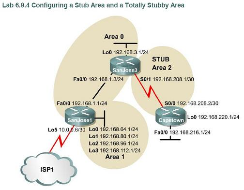

configuring ospf stub and totally stub area

Objective:

- configure ospf stub area (filter type 5 LSA E1 and E2 from populating stub area's router routing table)
- configure ospf totally stub area (cisco propietary, filter type 5 LSA, type 3 IA O, and type 4 IA O from populating stub area's router routing table)
- area 2 is a stub area. Capetown should have least routing table entry.

Topology:

Configs:

* * *

Usual ConfigsSanJose1:

SanJose1#sh run Building configuration...

Current configuration : 1244 bytes ! version 12.4 service timestamps debug datetime msec service timestamps log datetime msec no service password-encryption ! hostname SanJose1 ! boot-start-marker boot-end-marker ! enable secret 5 $1$LDb6$zEg.92Fgad6druYY83bUE0 ! no aaa new-model ! resource policy ! ip cef ! ! interface Loopback0 (simulate internal network on SanJose1) ip address 192.168.64.1 255.255.255.0 ! interface Loopback1 ip address 192.168.80.1 255.255.255.0 ! interface Loopback2 ip address 192.168.96.1 255.255.255.0 ! interface Loopback3 ip address 192.168.112.1 255.255.255.0 ! interface Loopback5 ip address 10.0.0.6 255.255.255.252 ! interface FastEthernet0/0 ip address 192.168.1.1 255.255.255.0 duplex half ! router ospf 1 log-adjacency-changes redistribute static (static routes redistribution using E2 type 5 LSA) network 192.168.1.0 0.0.0.255 area 0 network 192.168.64.0 0.0.63.255 area 1 default-information originate ! ip route 10.0.0.0 255.0.0.0 Null0 (simulate ISP connection) no ip http server no ip http secure-server ! ! ! logging alarm informational ! ! ! ! ! ! control-plane ! ! ! ! ! ! gatekeeper shutdown ! ! line con 0 exec-timeout 0 0 password cisco logging synchronous login stopbits 1 line aux 0 stopbits 1 line vty 0 4 exec-timeout 0 0 password cisco logging synchronous login ! ! end

SanJose1# SanJose3:

SanJose3#sh run Building configuration...

Current configuration : 1783 bytes ! version 12.4 service timestamps debug datetime msec service timestamps log datetime msec no service password-encryption ! hostname SanJose3 ! boot-start-marker boot-end-marker ! enable secret 5 $1$aHy.$gyYsVc6zVpucwrv99x296/ ! no aaa new-model ! resource policy ! ip cef ! interface Loopback0 ip address 192.168.3.1 255.255.255.0 ! interface FastEthernet0/0 ip address 192.168.1.3 255.255.255.0 duplex half ! interface Serial1/0 ip address 192.168.208.1 255.255.255.252 serial restart-delay 0 no dce-terminal-timing-enable ! interface Serial1/1 no ip address shutdown serial restart-delay 0 no dce-terminal-timing-enable ! interface Serial1/2 no ip address shutdown serial restart-delay 0 no dce-terminal-timing-enable ! interface Serial1/3 no ip address shutdown serial restart-delay 0 no dce-terminal-timing-enable ! interface Serial1/4 no ip address shutdown serial restart-delay 0 no dce-terminal-timing-enable ! interface Serial1/5 no ip address shutdown serial restart-delay 0 no dce-terminal-timing-enable ! interface Serial1/6 no ip address shutdown serial restart-delay 0 no dce-terminal-timing-enable ! interface Serial1/7 no ip address shutdown serial restart-delay 0 no dce-terminal-timing-enable ! router ospf 1 log-adjacency-changes network 192.168.1.0 0.0.0.255 area 0 network 192.168.3.0 0.0.0.255 area 0 network 192.168.208.0 0.0.0.3 area 2 ! no ip http server no ip http secure-server ! ! ! logging alarm informational ! ! ! ! ! ! control-plane ! ! ! ! ! ! gatekeeper shutdown ! ! line con 0 exec-timeout 0 0 password cisco logging synchronous login stopbits 1 line aux 0 stopbits 1 line vty 0 4 exec-timeout 0 0 password cisco logging synchronous login ! ! end

SanJose3# Capetown:

Capetown#sh run Building configuration...

Current configuration : 1711 bytes ! version 12.4 service timestamps debug datetime msec service timestamps log datetime msec no service password-encryption ! hostname Capetown ! boot-start-marker boot-end-marker ! enable secret 5 $1$FoDT$Gc/68u.1hX6wJWX66t/j2/ ! no aaa new-model ! resource policy ! ip cef ! ! interface Loopback0 ip address 192.168.220.1 255.255.255.0 ! interface FastEthernet0/0 ip address 192.168.216.1 255.255.255.0 duplex half ! interface Serial1/0 ip address 192.168.208.2 255.255.255.252 serial restart-delay 0 no dce-terminal-timing-enable ! interface Serial1/1 no ip address shutdown serial restart-delay 0 no dce-terminal-timing-enable ! interface Serial1/2 no ip address shutdown serial restart-delay 0 no dce-terminal-timing-enable ! interface Serial1/3 no ip address shutdown serial restart-delay 0 no dce-terminal-timing-enable ! interface Serial1/4 no ip address shutdown serial restart-delay 0 no dce-terminal-timing-enable ! interface Serial1/5 no ip address shutdown serial restart-delay 0 no dce-terminal-timing-enable ! interface Serial1/6 no ip address shutdown serial restart-delay 0 no dce-terminal-timing-enable ! interface Serial1/7 no ip address shutdown serial restart-delay 0 no dce-terminal-timing-enable ! router ospf 1 log-adjacency-changes network 192.168.208.0 0.0.0.3 area 2 ! no ip http server no ip http secure-server ! ! ! logging alarm informational ! ! ! ! ! ! control-plane ! ! ! ! ! ! gatekeeper shutdown ! ! line con 0 exec-timeout 0 0 password cisco logging synchronous login stopbits 1 line aux 0 stopbits 1 line vty 0 4 exec-timeout 0 0 password cisco logging synchronous login ! ! end

Capetown# result:

Capetown#sh ip route Codes: C - connected, S - static, R - RIP, M - mobile, B - BGP D - EIGRP, EX - EIGRP external, O - OSPF, IA - OSPF inter area N1 - OSPF NSSA external type 1, N2 - OSPF NSSA external type 2 E1 - OSPF external type 1, E2 - OSPF external type 2 i - IS-IS, su - IS-IS summary, L1 - IS-IS level-1, L2 - IS-IS level-2 ia - IS-IS inter area, \* - candidate default, U - per-user static route o - ODR, P - periodic downloaded static route

Gateway of last resort is not set

192.168.208.0/30 is subnetted, 1 subnets C 192.168.208.0 is directly connected, Serial1/0 192.168.64.0/32 is subnetted, 1 subnets O IA 192.168.64.1 \[110/66\] via 192.168.208.1, 00:06:48, Serial1/0 192.168.80.0/32 is subnetted, 1 subnets O IA 192.168.80.1 \[110/66\] via 192.168.208.1, 00:06:48, Serial1/0 O E2 10.0.0.0/8 \[110/20\] via 192.168.208.1, 00:06:48, Serial1/0 192.168.96.0/32 is subnetted, 1 subnets O IA 192.168.96.1 \[110/66\] via 192.168.208.1, 00:06:48, Serial1/0 192.168.112.0/32 is subnetted, 1 subnets O IA 192.168.112.1 \[110/66\] via 192.168.208.1, 00:06:48, Serial1/0 C 192.168.220.0/24 is directly connected, Loopback0 O IA 192.168.1.0/24 \[110/65\] via 192.168.208.1, 00:06:48, Serial1/0 192.168.3.0/32 is subnetted, 1 subnets O IA 192.168.3.1 \[110/65\] via 192.168.208.1, 00:06:49, Serial1/0

- O IA denotes LSA type 3 or type 4 Inter Area route summary, not filtered.
- O E2 denotes LSA type 5 external route summary, not filtered.
- So, Capetown's routing table is full, not efficient for a stub area router. We need to filter type 3 or 4 LSA using stub configuration. More efficiently, we also need to filter type 5 LSA using totally stubby configuration (cisco propietary)
- gateway of last resort is not set.

Stub Configs:

SanJose3:

just add these lines to make area 2 a stub area.

SanJose3:

SanJose3#conf t Enter configuration commands, one per line. End with CNTL/Z. SanJose3(config)#router ospf 1 SanJose3(config-router)#area 2 stub

Capetown:

Capetown#conf t Enter configuration commands, one per line. End with CNTL/Z. Capetown(config)#router ospf 1 Capetown(config-router)#area 2 stub

result:

Capetown(config-router)#do sh ip route Codes: C - connected, S - static, R - RIP, M - mobile, B - BGP D - EIGRP, EX - EIGRP external, O - OSPF, IA - OSPF inter area N1 - OSPF NSSA external type 1, N2 - OSPF NSSA external type 2 E1 - OSPF external type 1, E2 - OSPF external type 2 i - IS-IS, su - IS-IS summary, L1 - IS-IS level-1, L2 - IS-IS level-2 ia - IS-IS inter area, \* - candidate default, U - per-user static route o - ODR, P - periodic downloaded static route

Gateway of last resort is 192.168.208.1 to network 0.0.0.0

192.168.208.0/30 is subnetted, 1 subnets C 192.168.208.0 is directly connected, Serial1/0 192.168.64.0/32 is subnetted, 1 subnets O IA 192.168.64.1 \[110/66\] via 192.168.208.1, 00:09:38, Serial1/0 192.168.80.0/32 is subnetted, 1 subnets O IA 192.168.80.1 \[110/66\] via 192.168.208.1, 00:09:38, Serial1/0 192.168.96.0/32 is subnetted, 1 subnets O IA 192.168.96.1 \[110/66\] via 192.168.208.1, 00:09:38, Serial1/0 192.168.112.0/32 is subnetted, 1 subnets O IA 192.168.112.1 \[110/66\] via 192.168.208.1, 00:09:38, Serial1/0 C 192.168.220.0/24 is directly connected, Loopback0 O IA 192.168.1.0/24 \[110/65\] via 192.168.208.1, 00:09:38, Serial1/0 192.168.3.0/32 is subnetted, 1 subnets O IA 192.168.3.1 \[110/65\] via 192.168.208.1, 00:09:40, Serial1/0 O\*IA 0.0.0.0/0 \[110/65\] via 192.168.208.1, 00:09:40, Serial1/0

- No More O E2 routes because type 5 LSAs are filtered.
- The routing table become a little bit smaller -just a little bit though.
- gateway of last resort is automatically added.

Totally Stub Configs:

to configure area 2 as totally stubby, u have to change the configuration above -only at the ABR, in this case SanJose3 router. While Capetown's config doesn't have to be changed.

SanJose3#conf t Enter configuration commands, one per line. End with CNTL/Z. SanJose3(config)# SanJose3(config)#router ospf 1 SanJose3(config-router)#no area SanJose3(config-router)#no area 2 stub SanJose3(config-router)#are SanJose3(config-router)#area SanJose3(config-router)#area 2 stu SanJose3(config-router)#area 2 stub no SanJose3(config-router)#area 2 stub no-summary

result:

Capetown(config-router)#do sh ip route Codes: C - connected, S - static, R - RIP, M - mobile, B - BGP D - EIGRP, EX - EIGRP external, O - OSPF, IA - OSPF inter area N1 - OSPF NSSA external type 1, N2 - OSPF NSSA external type 2 E1 - OSPF external type 1, E2 - OSPF external type 2 i - IS-IS, su - IS-IS summary, L1 - IS-IS level-1, L2 - IS-IS level-2 ia - IS-IS inter area, \* - candidate default, U - per-user static route o - ODR, P - periodic downloaded static route

Gateway of last resort is 192.168.208.1 to network 0.0.0.0

192.168.208.0/30 is subnetted, 1 subnets C 192.168.208.0 is directly connected, Serial1/0 C 192.168.220.0/24 is directly connected, Loopback0 O\*IA 0.0.0.0/0 \[110/65\] via 192.168.208.1, 00:01:05, Serial1/0

- No more type 5 LSA (E1 or E2) route summary.
- No more type 3 or 4 LSA (O IA) route summary.
- Now, the routing table is definitely small.
- gateway of last resort is automatically added.

Summary:

- for stub networks router, it is better to keep the routing table small. use stub or totally stub area.
- stub configuration applied on both interface of an areas link. stub configuration filter type 5 LSA (E1 or E2) from populating stub networks router routing table. gateway of last resort automatically added by the ABR.
- totally stub configuration applied only at the ASBRs interface. stub configuration filter type 5 (E1 or E2), type 3 and type 4 LSA (O IA) from populating stub networks router routing table. gateway of last resort automatically added by the ABR.
- The problem is : network 192.168.220.1 and 192.168.216.1 (both on router Capetown) can not be accessed from SanJose1 and SanJose3 (those networks injected to the OSPF AS using type 5 LSA -remember type 5 LSAs are filtered on stub area). I believe, this will be solved by NSSA configuration.
