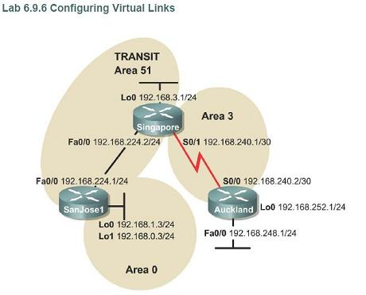

configuring ospf virtual link

Objective

configure an OSPF virtual link so that a disconnected area can reach the backbone as required by OSPF.

Topology

Configs

SanJose1#sh run Building configuration...

Current configuration : 1015 bytes ! version 12.4 service timestamps debug datetime msec service timestamps log datetime msec no service password-encryption ! hostname SanJose1 ! boot-start-marker boot-end-marker ! enable secret 5 $1$bP5E$pamhnCUi0AcSl/F9Rej651 ! no aaa new-model ! resource policy ! ip cef ! ! ! ! ! ! ! ! ! ! ! ! ! ! ! ! ! ! ! ! ! ! ! ! ! ! interface Loopback0 ip address 192.168.1.3 255.255.255.0 ! interface Loopback1 ip address 192.168.0.3 255.255.255.0 ! interface FastEthernet0/0 ip address 192.168.224.1 255.255.255.0 duplex half ! router ospf 1 log-adjacency-changes network 192.168.0.0 0.0.0.255 area 0 network 192.168.1.0 0.0.0.255 area 0 network 192.168.224.0 0.0.0.255 area 51 ! no ip http server no ip http secure-server ! ! ! logging alarm informational ! ! ! ! ! ! control-plane ! ! ! ! ! ! gatekeeper shutdown ! ! line con 0 exec-timeout 0 0 password cisco logging synchronous login stopbits 1 line aux 0 stopbits 1 line vty 0 4 exec-timeout 0 0 password cisco logging synchronous login ! ! end

SanJose1#

Singapore#sh run Building configuration...

Current configuration : 1790 bytes ! version 12.4 service timestamps debug datetime msec service timestamps log datetime msec no service password-encryption ! hostname Singapore ! boot-start-marker boot-end-marker ! enable secret 5 $1$bPdv$hcFIbsP8L4rzFyuNrFoqE0 ! no aaa new-model ! resource policy ! ip cef ! ! ! ! ! ! ! ! ! ! ! ! ! ! ! ! ! ! ! ! ! ! ! ! ! ! interface Loopback0 ip address 192.168.3.1 255.255.255.0 ! interface FastEthernet0/0 ip address 192.168.224.2 255.255.255.0 duplex half ! interface Serial1/0 ip address 192.168.240.1 255.255.255.252 serial restart-delay 0 no dce-terminal-timing-enable ! interface Serial1/1 no ip address shutdown serial restart-delay 0 no dce-terminal-timing-enable ! interface Serial1/2 no ip address shutdown serial restart-delay 0 no dce-terminal-timing-enable ! interface Serial1/3 no ip address shutdown serial restart-delay 0 no dce-terminal-timing-enable ! interface Serial1/4 no ip address shutdown serial restart-delay 0 no dce-terminal-timing-enable ! interface Serial1/5 no ip address shutdown serial restart-delay 0 no dce-terminal-timing-enable ! interface Serial1/6 no ip address shutdown serial restart-delay 0 no dce-terminal-timing-enable ! interface Serial1/7 no ip address shutdown serial restart-delay 0 no dce-terminal-timing-enable ! router ospf 1 log-adjacency-changes network 192.168.3.0 0.0.0.255 area 51 network 192.168.224.0 0.0.0.255 area 51 network 192.168.240.0 0.0.0.3 area 3 ! no ip http server no ip http secure-server ! ! ! logging alarm informational ! ! ! ! ! ! control-plane ! ! ! ! ! ! gatekeeper shutdown ! ! line con 0 exec-timeout 0 0 password cisco logging synchronous login stopbits 1 line aux 0 stopbits 1 line vty 0 4 exec-timeout 0 0 password cisco logging synchronous login ! ! end

Singapore#

Auckland#sh run Building configuration...

Current configuration : 1711 bytes ! version 12.4 service timestamps debug datetime msec service timestamps log datetime msec no service password-encryption ! hostname Auckland ! boot-start-marker boot-end-marker ! enable secret 5 $1$W3Ux$X4cR/1jc27f9IbV5b.Qgn0 ! no aaa new-model ! resource policy ! ip cef ! ! ! ! ! ! ! ! ! ! ! ! ! ! ! ! ! ! ! ! ! ! ! ! ! ! interface Loopback0 ip address 192.168.252.1 255.255.255.0 ! interface FastEthernet0/0 ip address 192.168.248.1 255.255.255.0 duplex half ! interface Serial1/0 ip address 192.168.240.2 255.255.255.252 serial restart-delay 0 no dce-terminal-timing-enable ! interface Serial1/1 no ip address shutdown serial restart-delay 0 no dce-terminal-timing-enable ! interface Serial1/2 no ip address shutdown serial restart-delay 0 no dce-terminal-timing-enable ! interface Serial1/3 no ip address shutdown serial restart-delay 0 no dce-terminal-timing-enable ! interface Serial1/4 no ip address shutdown serial restart-delay 0 no dce-terminal-timing-enable ! interface Serial1/5 no ip address shutdown serial restart-delay 0 no dce-terminal-timing-enable ! interface Serial1/6 no ip address shutdown serial restart-delay 0 no dce-terminal-timing-enable ! interface Serial1/7 no ip address shutdown serial restart-delay 0 no dce-terminal-timing-enable ! router ospf 1 log-adjacency-changes network 192.168.240.0 0.0.0.3 area 3 ! no ip http server no ip http secure-server ! ! ! logging alarm informational ! ! ! ! ! ! control-plane ! ! ! ! ! ! gatekeeper shutdown ! ! line con 0 exec-timeout 0 0 password cisco logging synchronous login stopbits 1 line aux 0 stopbits 1 line vty 0 4 exec-timeout 0 0 password cisco logging synchronous login ! ! end

Auckland#

Auckland#sh ip route Codes: C - connected, S - static, R - RIP, M - mobile, B - BGP D - EIGRP, EX - EIGRP external, O - OSPF, IA - OSPF inter area N1 - OSPF NSSA external type 1, N2 - OSPF NSSA external type 2 E1 - OSPF external type 1, E2 - OSPF external type 2 i - IS-IS, su - IS-IS summary, L1 - IS-IS level-1, L2 - IS-IS level-2 ia - IS-IS inter area, \* - candidate default, U - per-user static route o - ODR, P - periodic downloaded static route

Gateway of last resort is not set

192.168.240.0/30 is subnetted, 1 subnets C 192.168.240.0 is directly connected, Serial1/0 C 192.168.252.0/24 is directly connected, Loopback0 Auckland#

See that there's no OSPF routes distributed to the Auckland router.

Inter Area traffice must transit the backbone area. Even though area 51 and area 3 are adjacent, they do not share OSPF routing updates.

Still, Singapore and Auckland has been able to form adjacency (sh ip ospf nei).

Area 3 is not connected to the area 0.

router Singapore is the ABR for area3, router SanJose1 is the ABR for area 0. therefore we must configure virtual link on Singapore and SanJose1 via area 51 as the transit area.

On SanJose1:

! router ospf 1 log-adjacency-changes area 51 virtual-link 192.168.3.1 (this is the other router's RID) network 192.168.0.0 0.0.0.255 area 0 network 192.168.1.0 0.0.0.255 area 0 network 192.168.224.0 0.0.0.255 area 51 !

On Singapore:

! router ospf 1 log-adjacency-changes area 51 virtual-link 192.168.1.3 (this is the other router's RID) network 192.168.3.0 0.0.0.255 area 51 network 192.168.224.0 0.0.0.255 area 51 network 192.168.240.0 0.0.0.3 area 3 ! Result:

Auckland#sh ip route Codes: C - connected, S - static, R - RIP, M - mobile, B - BGP D - EIGRP, EX - EIGRP external, O - OSPF, IA - OSPF inter area N1 - OSPF NSSA external type 1, N2 - OSPF NSSA external type 2 E1 - OSPF external type 1, E2 - OSPF external type 2 i - IS-IS, su - IS-IS summary, L1 - IS-IS level-1, L2 - IS-IS level-2 ia - IS-IS inter area, \* - candidate default, U - per-user static route o - ODR, P - periodic downloaded static route

Gateway of last resort is not set

O IA 192.168.224.0/24 \[110/65\] via 192.168.240.1, 00:01:32, Serial1/0 192.168.240.0/30 is subnetted, 1 subnets C 192.168.240.0 is directly connected, Serial1/0 192.168.0.0/32 is subnetted, 1 subnets O IA 192.168.0.3 \[110/66\] via 192.168.240.1, 00:00:01, Serial1/0 192.168.1.0/32 is subnetted, 1 subnets O IA 192.168.1.3 \[110/66\] via 192.168.240.1, 00:00:01, Serial1/0 C 192.168.252.0/24 is directly connected, Loopback0 192.168.3.0/32 is subnetted, 1 subnets O IA 192.168.3.1 \[110/65\] via 192.168.240.1, 00:01:32, Serial1/0

See that finally Auckland router receives LSA from area 0 through the virtual links. You can also do the sh ip ospf virtual-links to see the virtual-links condition.

Summary

- virtual links should be configured on both edge via transit area.
- inter area traffic mus transit area backbone.
