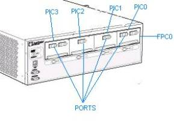
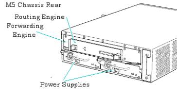
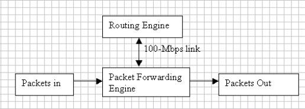

I. Juniper® Routers and Junos™

I.A Juniper® Routers Hardware and Features

1. Routers Types

Juniper routers are primarily available in the following series:

· E-Series,

· J-Series,

· M-Series, and

· T-Series.

However, here we discuss overview of different series of routers and architecture and functioning of a typical M-Series router. A Juniper router runs JUNOS™ networking software and supports Internet Protocols. The following discussion would enable us to understand the hardware and software components of a Juniper router in more detail.

E-Series Routers: The E-series network router support a suite of Internet routing protocols, including BGP-4, IS-IS, OSPF, and RIP. E-series edge routers ideal for service providers that operate high-capacity POPs.

The E-series family of Broadband Services Routers provide large bandwidth capacities and advanced QoS capabilities, and designed to act as the aggregation point where service providers accept and authenticate remote connections from customers.

The E-series family provides bandwidth capacity options from 5, 10, or 40 Gbps up to 100 and 320 Gbps and supports high-port density WAN interfaces in a compact package.

Interface options include OC-3/STM-1, OC-12/STM-4, OC-48/STM-16, Fast Ethernet, and Gigabit Ethernet, as well as channelized DS-1, DS-3, E1, and E3.

J-Series: The J-series Services Router hardware platform that is suitable for smaller sites, including remote, branch, and regional offices. The J-series routers offer advanced routing, QoS, security, and management policies.

M and T-Series: Juniper® enterprise level routers are primarily available in a. M-series and b. T-series routers. T-series and M-series platforms share a common architecture that separates routing, forwarding, and services functions to facilitate scalability and security. The M-series family can be deployed in both the service-provider environment and high-end enterprise environments.

The routers offer filtering, policing, rate limiting, and sampling where as the T-series platforms use the T-series Internet Processor for route lookups and notification forwarding.. The M-Series routers are available in M5, M10, M20, M40, M160, and others. The T-series routers are available in T320 and T-640.

A typical chassis for M5 router is shown below (This is given for educational purpose only, please refer official website for exact information). The front and rear views of M5 Internet Router are given.

M5 Chassis Front Panel:

M5 Chassis: Rear Panel:

The rear panel of the M5 router is shown in the above figure. It contains a routing engine, forwarding engine, and power supplies. These will be discussed in the coming sections.

2. Hardware components

The major hardware components in a Juniper routers are given below:

Router Chassis:

Chassis is a rigid sheet metal, which contains all other router components. Please refer to the typical router chassis below.

Front Panel

REAL PANEL

Flexible PIC Concentrators:

The FPCs contains the Physical interface Cards (PICs) used in the router and connect them to other router components. FPCs install into the front of the router in either a vertical or horizontal orientation, depending on the router.

Physical Interface Cards:

PICs are used to connect to a network media. PICs receive incoming packets from the network and transmit outgoing packets to the network. PICs encapsulate the packets received from the FPCs before transmitting them to the network.

Routing Engine:

The Routing Engine consists of an Intel-based PCI platform running the JUNOS software. The Routing Engine maintains the routing tables used by the router. Routing Engine consists of a CPU; SDRAM for storage of the routing and forwarding tables and other processes; a compact flash disk for primary storage of software images, configuration files, and microcode; a hard disk for secondary storage; a PC card slot (on some M40 routers, a floppy disk) for storage of software upgrades; and interfaces for out-of-band management access.

Power Supplies:

Each Juniper Routers has one, two, or four load-sharing power supplies. The power supplies are connected to the router midplane (on an M40 router, to the router backplane), which distributes the different output voltages throughout the router and its components. Some routers can operate using either AC or DC power while the other routers operate with DC power only.

Cooling System:

The cooling system keeps all router components within the recommended operating temperature limits. If one component of the cooling system fails or is removed, the system automatically adjusts the speed of the remaining components to keep the temperature within the acceptable range. The cooling system for each router is unique and can consist of fans, impellers, and air filters

## 3\. Router Architecture for M-series Routers and T-series Platforms:

The router architecture separates routing and control functions from packet forwarding operations, which results in increase in the performance of the router.

Each router consists of two major architectural components:

- The Routing Engine, which provides Layer-3 routing services and network management.
    
- The Packet Forwarding Engine, which provides all operations required for transit packet forwarding.
    

Figure 1: Simplified Router Architecture:

The routing engine constructs one or more routing tables, from these routing tables routing engine generates a table of active routes called forwarding table, this table is then copied into packet forwarding engine.

Routing Engine is the logical location to store the JUNOS software. The Routing Engine operates all routing protocols and makes all routing table decisions, herby building a master routing table with the best path to each destination. The router then places these best paths into the forwarding table on the Routing Engine and copies that same data into the forwarding table on the Packet Forwarding Engine.

# 4\. Features:

The important features of M-Series and T-Series routers include the following:

a. IPv4 and IPv6 unicast and multicast support

b. Routing: Supports IS-IS, RIP ng, BGP, OSPF v3, and Static

c. IP/MPLS routing

d. L2 VPNs, L3 VPNs

e. Supports ICMP v6

f. Offers CLI, and JUNIScript API

g. The routers support a variety of high-speed interfaces (including SONET/SDH, Ethernet, and ATM) for large networks and network applications.

h. High Availablility Options such as Graceful RE Switchover (GRES), and Bidirectional Forwarding Detection (BFD).

http://www.tutorialsweb.com
