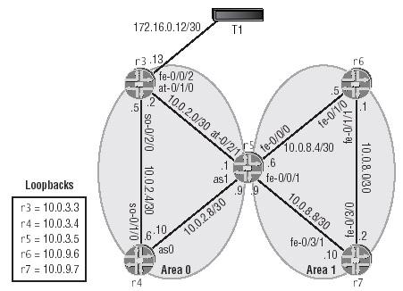

esigpri@SRLAB1# run show configuration logical-routers r3 { interfaces { fe-1/3/0 { unit 611 { vlan-id 611; family inet { address 10.0.2.2/30; } } } fe-1/3/1 { unit 616 { vlan-id 616; family inet { address 10.0.2.5/30; } } } } } r4 { interfaces { fe-1/3/0 { unit 616 { vlan-id 616; family inet { address 10.0.2.6/30; } } } fe-1/3/1 { unit 615 { vlan-id 615; family inet { address 10.0.2.10/30; } } } } } r5 { interfaces { fe-1/3/0 { unit 612 { vlan-id 612; family inet { address 10.0.8.6/30; } } unit 615 { vlan-id 615; family inet { address 10.0.2.9/30; } } } fe-1/3/1 { unit 611 { vlan-id 611; family inet { address 10.0.2.1/30; } } unit 614 { vlan-id 614; family inet { address 10.0.8.9/30; } } } } } r6 { interfaces { fe-1/3/0 { unit 613 { vlan-id 613; family inet { address 10.0.8.1/30; } } } fe-1/3/1 { unit 612 { vlan-id 612; family inet { address 10.0.8.5/30; } } } } } r7 { interfaces { fe-1/3/0 { unit 614 { vlan-id 614; family inet { address 10.0.8.10/30; } } } fe-1/3/1 { unit 613 { vlan-id 613; family inet { address 10.0.8.2/30; } } } } }

\[edit\] esigpri@SRLAB1#
