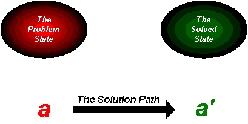
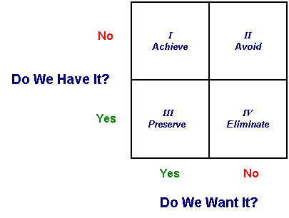
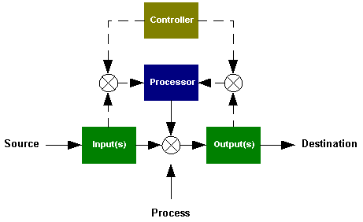

Solution Engineering: Ten Tips for Beefing Up Your Problem Solving Toolbox

© Fred Nickols 2000

This article was first published under the pen name of Peter W. Taylor and appeared in the July 1994 issue of _Performance and Instruction._

## Introduction

Problems come in all sizes, shapes, and colors. There is no single or simple step-by-step process guaranteeing us we will solve every problem we encounter. We are faced instead with the requirement to configure or adapt our problem solving processes to fit the problem at hand. As problem solvers, we have more in common with the cabinet-maker than the assembly-line worker. What we need, then, are plans and blueprints, high-quality materials, a decent place to work, a well-stocked tool box, and the skill and knowledge necessary to properly select and use the tools in it. Toward that end, here are ten tips—ideas for “beefing up” the tools in your problem solving tool box.

1. Focus on the solved state.
2. Be clear about _all_ your goals and objectives.
3. Expand your definition of “Define the Problem.”
4. Think of problem solving as a cover-the-bases activity.
5. Draw diagrams and otherwise picture the structure of the problem.
6. Take the concept of cause with a grain of salt.
7. Watch out for “disconnects.”
8. Be aware of your own blinders.
9. Develop your own system for solving problems.
10. Research the subject matter.

Each of these tips is elaborated upon in the following sections.

## 1\. Focus on the solved state

Pay at least as much attention to the solved state as is paid to the problem state. As Robert F. Mager’s (1962) fable of the sea horse reminds us, “if you’re not sure where you’re going, you’re liable to end up someplace else—and not even know it (p.vii).”

When solving a problem, we typically wish to do more than simply rid ourselves of some unacceptable situation. More often than not we are trying also to achieve some other, more desirable state of affairs. Theoretically speaking, we’re trying to move from the problem state to the solved state. We do so by traversing what is called “the solution path” (see Figure 1).

 

_**Figure 1: The Solution Path**_

It seems obvious that if we do not focus some of our attention on the solved state, the likelihood of attaining it is diminished. Unfortunately, the problem state typically attracts all our attention. The squeaky wheel gets the grease. On occasion, this is an appropriate response. If the roof is caving in, then discussions about where to go can wait until we’re safely outside.

But, if we’re not in an emergency situation, and if we still have nothing more in mind than doing something to rid ourselves of the problem state, we can create situations where all we do is move from problem to problem, the result of the solution to one problem creating one or more new problems. These are what Chester Barnard (1938) termed “inefficient” solutions. An “efficient” solution, of course, creates no new problems.

There are several ways of focusing on the solved state. One is to define it the same way we would define the problem state (more about that under Tip #3). Another is to list possible measures or indicators of its attainment. Ask yourself questions like these: “How will I know the problem has been solved? What will I accept as evidence? What does the solved state look like?” Yet a third is to be clear about all the goals and objectives of the problem solving effort. (This last point is so important that it constitutes a tip all its own—the next one.)

## **2\. Be clear about _all_ your goals and objectives**

Ultimately, the aim of problem solving is action. To engage in problem solving is to search for a solution. To actually solve a problem is to implement the solution that has been found and demonstrate that it works. Solving problems requires intervention as well as investigation.

Intervening in complex organizations requires of us that we carefully think through the likely effects of any actions we are contemplating. Actions taken in an organizational context often “ripple” outward from the point of intervention, sometimes having unforeseen and unintended consequences. Our goals and objectives, therefore, are typically multi-dimensional, that is, we seek to eliminate some conditions, and to achieve others. There also are conditions we seek to preserve or avoid.

One way of examining the multi-dimensionality of our goals and objectives is to compare and identify any disparities between our perceptions (what we have) and our preferences (what we want). This comparison is shown in Figure 2.

**_Figure 2 - The Goals Grid_**

If we don’t want something that already exists, our goal is typically one of eliminating it. If we want something that doesn’t exist, our goal is ordinarily one of achieving it. Four categories of goals and objectives can be derived from the interplay of our perceptions and preferences: Achieve, Preserve, Avoid, and Eliminate (Arnold, 1978; Nickols, 1992).

For any problem situation, it is useful to ask the following questions as a way of clarifying all your goals and objectives:

1. What are we trying to _achieve_?
2. What are we trying to _preserve_?
3. What are we trying to _avoid_?
4. What are we trying to _eliminate_?

## **3\. Expand your definition of “Define the Problem”**

Perhaps the best-known step in the problem solving process is the one most people think of as the first step: “Define the Problem.” This is probably the most misunderstood and poorly executed step in the process. For many people, “Define the Problem” means simply to provide a written definition or statement of the problem. There is much more to it than that.

To define means to establish boundaries, to encompass, to enclose, to locate, to isolate, to distinguish, to differentiate, to set apart. To define the problem state (or the solved state) means, at the very least, to do the following:

1. To establish boundaries; to delineate (Locate).
2. To give distinguishing characteristics; to differentiate (Isolate).
3. To state the nature of; to describe precisely (Articulate).
4. To state the meaning of; to provide a definition (Explicate).

Rarely are definitions of the problem state or the solved state crystal-clear up front. Clarity typically develops over time. In many cases, the definition of a problem may be considered complete only after the problem has been solved. Until then, it is a shifting, evolving, changing part of the process. Thus, although “Defining the Problem” is a good step with which to begin the problem solving process, it is only a starting point and it must be revisited on a regular basis. This also is true of any definition of the solved state.

## 4\. Think of problem solving as a cover-the-bases activity

Information does not make itself available to suit the requirements of anyone’s problem solving process. Solving a problem in a complex organization has much in common with detective work. We are forced to follow leads and unearth clues. Further, it is generally the case in complex organizations that no one individual possesses all the information necessary to solve a given problem. Vital information appears in bits and pieces. We have different backgrounds, perceptual filters, and value priorities. Different people seek and assimilate information in different ways.

Consequently, if you listen carefully to almost any discussion of a problem in a group setting, what you’ll hear is conversation that shifts from problem to symptom to cause to solution and back again, often in no particular order, a fact much lamented by Charles Kepner and Benjamin Tregoe (1965) in their classic little book, _The Rational Manager_. Such “bouncing around” is natural. Don’t worry about it. Above all else, don’t try to force yourself (or others) to follow some lock-step, linear process. The task of problem solving is very much a matter of piecing things together.

A systematic approach is necessary but the point of having one is to make sure you tend to all the things that need tending to, that you “cover the bases,” not trot around them in a 1-2-3 fashion. Here is a list of twelve “bases” to be covered or tasks that typically need tending to in the course of solving a problem:

1. Defining the problem state.
2. Specifying the solved state.
3. Modeling the structure of the problem.
4. Finding and fixing the “cause” of the problem.
5. Engineering a solution.
6. Settling on a course of action.
7. Reconciling restraints and constraints.
8. Obtaining support and consensus.
9. Preparing plans and schedules.
10. Taking action.
11. Assessing its effects and consequences.
12. Adjusting future actions as required.

Steps 4 and 5 are typically mutually exclusive; you do one or the other but not both. If you’re dealing with a problem where something has gone wrong, then your best bet, at least initially, is to focus on finding and fixing the cause of the problem. On the other hand, if you’re out to achieve some state of affairs never before attained, or if the cause of the problem has been found but can’t be corrected, then you’ll have to engineer a solution to the problem. In either case, you’ll have to settle on a course of action and carry it out. Step 3 is very important and is elaborated upon in the next tip.

## 5\. Draw pictures of the structure of the problem

A picture or model of the elements and relationships in a problem situation will help you to more quickly and more completely grasp the situation and figure out what to do about it.

**_Figure 3: A General Purpose Work System_**

Consider, for example, the diagram shown in Figure 3. It depicts the structure of a general-purpose work system. The elements of this system include inputs, a processor, outputs, a controller, and two control loops. On the front end of this system is a task initiation loop and on the back end is an evaluation and termination loop (the dotted lines). The relationships among these elements are such that inputs to the work system interact with the processor. The interactions between inputs and processor, which typically consist of prefigured routines, are referred to as “processes.” These processes produce the work system’s outputs. All this occurs under the watchful eye of the controller.

If the outputs of the work system are faulty, several possibilities are suggested by the structure of the diagram in Figure 3. The inputs might be faulty. The processor or the controller might be malfunctioning. Perhaps one or the other or both of the control loops is open and no information is getting through. Whatever the contributing factors, the diagram provides guidance regarding places to look for what might be causing the problem and for what might have to be changed in order to solve it.

The use of diagrams or schematics as an aid to problem solving is not new. Technicians have been using schematics as troubleshooting aids for years. Computer programmers and systems analysts are familiar with, if not dependent on, flowcharts and data structure models. Industrial engineers have relied on process flow diagrams ever since the days of Frederick Winslow Taylor. Diagrams and schematics should be found in your problem solving tool box too.

## 6\. Take the concept of cause with a grain of salt

If ever there was a time-waster in problem solving, it has to be the search for the cause of the problem. Don’t misunderstand—the concept of cause is frequently relevant, but its usefulness depends on the kind of problem being solved. It’s not relevant all the time and, for some problems, it’s never relevant.

For certain kinds of problems, mostly in contrived physical systems like the work processing system depicted in Figure 3, the concept of cause makes sense. Things are going along just fine, something happens, and matters take a turn for the worse. A component in a piece of equipment burns out. A fuse blows. A tire picks up a nail and goes flat. In such cases, and countless more of a similar nature, the search for cause is indeed relevant.

But not all problems can be said to be caused. And not all causes can be corrected.

The stock market crashed in October of 1987. The stock of many companies plummeted in value. Why? Well, not even the SEC can provide an answer to this question. Some attribute it to computerized trading and faulty buy-sell algorithms. Others chalk it up to a loss of investor confidence. Whatever caused the crash of ‘87, no one has yet found the cause and fixed it.

At a more mundane level, consider the employee who doesn’t know how to perform a certain task. Suppose this person was never trained to perform the task. Suppose the task itself was only recently made a part of the person’s job, the result of a reduction in force in response to straitened economic circumstances. What’s the “cause” in this case? Is it the employee’s lack of knowledge? Is it the fact that she was not trained? Is it the newness of the task? Is it the reduction in force? Or is it the economic conditions that led to the reduction in force?

The point of this tip is a simple one: The concept of cause is relevant in some cases but not in others. Take the time early in your problem-solving efforts to decide if the concept of cause is or isn’t relevant before you spend time and energy looking for something that doesn’t exist or that can’t be corrected.

## 7\. Watch out for disconnects

The term “disconnect” refers to the uncoupling of solutions from the problems they are intended to solve. This typically happens when one person or group of persons defines the problem, a second person or group of persons is assigned to figure out what to do about it, and yet a third person or group of persons is tasked with actually implementing the solution.

Vertical disconnects occur frequently. An executive spots a problem. A middle manager gets the job of coming up with an action plan. And a line manager or supervisor gets the unenviable job of doing the unthinkable for unfathomable reasons. No one clarifies, questions, or challenges the definition of the problem (which might or might not have been sharply defined to begin with). As a result, the solution has no bearing on the original problem and might have very undesirable side effects as well.

Horizontal disconnects also occur frequently. These commonly surface in efforts to develop computer-based information systems. This scenario starts with business people laying out the problem for business analysts. The business analysts translate and relay the problem to the systems analysts. The systems analysts translate and relay the problem to the programmers. A system gets built. Then, one of three things happens:

1. The system is scrapped because it’s taking too long and costs too much to develop.
2. The system doesn’t work as intended because no one knows what was intended in the first place, or because the definition of the problem was lost in repeated translations, or because it was left at one of the relay stations.
3. The system works as intended, but all it accomplishes is the automation of what was being done manually, making the underlying processes all the more difficult to get at and improve. In effect, resistance to change is mechanized.

Beware of disconnects!

## 8\. Be aware of your own blinders

We all wear a custom-tailored set of “blinders,” that is, perceptual and value-based filters that lead us to see or not see certain things, or to interpret them in certain ways. These blinders are sometimes useful, sometimes not. In all cases, it pays to know what they are.

When it comes to problems and problem solving, there are several ways we can get a peek at how we’re placing our own personal “spin” on things. One is the way we label the problem.

Labels invoke what Allen Newell and Herbert Simon (1972) termed the “problem space.” If I label a problem a “personnel” problem, for instance, I invoke one set of models and concepts, and call into play a certain realm of knowledge. If I label that same problem a “business” problem, or a “production” problem, or “an attitude” problem, I invoke different sets of models and concepts, and different realms of knowledge. Problem labels influence the way I frame a problem, they lead me look in different places for different things. It is useful to pause during the course of working on a problem and ask yourself how you’ve got it labeled. Deliberately changing the label can also be useful.

Another way of gaining insight into the way we frame various classes of problems, and thus invoke certain families of solutions, is to examine the solutions we propose. If we think training is the answer, we have framed the problem one way. If we recommend a reorganization, we’ve framed it a very different way. If we think replacing certain people will do the job, we have yet a third view of the problem. Looking at the solutions we propose—and prefer—will tell us a lot about the way we classify and frame problems as well as our underlying biases and filters.

Yet a third way of getting at our own blinders is rooted in our goals and objectives. Thinking about what we wish to achieve, preserve, avoid, and eliminate—and why—can help us sort out how much of the analytical ax we’re grinding is personal and how much of it is rational problem solving.

## 9\. Develop your own system for solving problems

This amounts to recommending that you reinvent the wheel. Be that as it may, the point is that you simply cannot pick up someone else’s conceptual tools and make immediate use of them. A certain amount of adaptation is unavoidable.

As a problem solver, you must develop your own system for solving problems. You have to develop a scheme whereby you can tell if a given problem solving tool is useful or not and put it to use accordingly.

An earlier example of a problem solving tool that might or might not be useful in a given situation was the concept of cause. Below are three more. These are techniques.

1. **_Brainstorming_**. Coming up with ideas is important, and brainstorming is a good way to do that. But, brainstorming won’t take the place of detailed financial analysis. And brainstorming won’t tell you who’s going to oppose your definition of the problem. And brainstorming won’t tell you how to persuade that person to support your definition—or lead you to acknowledge that there may be merit in her position. Brainstorming is a useful technique, but not for all occasions. The definitive book on this subject is _Applied Imagination_, by Alex Osborn.
2. **_Force-Field Analysis_**. This, too, is a useful technique—in certain situations. But, think about that flat tire mentioned earlier or, better yet, the piece of equipment with the burned-out component. Force-field analysis isn’t likely to be of much use in determining which component burned out (and neither is brainstorming). In general, force-field analysis is a useful technique for examining psychological and sociological factors or forces, but there are better tools available for diagnosing problems in physical systems. A good summary of this technique can be found in the second edition of _The Planning of Change_.
3. **_Root Cause Analysis_**. This technique has its roots in quality control. It is most clearly associated with famed Japanese quality guru, Kaoru Ishikawa and it typically makes use of a diagramming method yielding a product known as an “Ishikawa” or “fishbone” diagram. It is a structured method for identifying the factors that contribute to the effects observed in a given situation but it is not a means for identifying the structure of the problem. Those interested in the technique of root cause analysis can find adequate explanations in _Kaizen_, by Masaaki Imai, _The Customer Driven Company_, by Richard C. Whiteley, and in Section 22, of _Juran’s Quality Control Handbook._

## 10\. Research the subject matter

There is no easy way, no shortcut to becoming a first-rate problem solver. It takes years of work and study and practice—and researching the subject matter.

Many books have been written about problem solving and solving problems. It would take a great deal of time to read them all—if you were so inclined. The good stuff is scattered about in several books. A tidbit here, a morsel there, a snack now and then, but hardly ever a full meal, let alone a feast.

Below is my personal list of favorites, what I view as the five best books ever written about problem solving, with a few comments regarding each.

- _How We Think_ (1910). John Dewey. Heath: Boston

> Dewey’s book addresses problem solving in the larger context of reflective thinking. Dewey’s explication of the problem-solving process is as relevant today as when he first wrote it, including his introduction of now commonplace concepts such as the definition of a problem situation as a discrepancy or deviation. If you can’t find it in the library, try an antiquarian book store; I found a first edition in first-rate condition for $25.00.

- _The Functions of The Executive_ (1938). Chester I. Barnard. Harvard University Press: Cambridge

> Barnard’s book is a classic in management literature. Of particular interest to problem solvers are his notions of the efficiency and effectiveness of solutions as well as of the problem-solving process that produces them. Barnard’s book is extremely relevant to anyone wishing to grasp the nature and structure of “business” problems.

- _The Rational Manager_ (1965). Charles H. Kepner and Benjamin B. Tregoe. McGraw-Hill: New York.

> Messrs. Kepner and Tregoe’s little book is a classic too. It is the bible for many organizational problem solvers. However, the problem-solving process it presents rests squarely on cause-effect thinking and, in my opinion, applies chiefly to problems in physical systems. It is perhaps the best of the troubleshooting genre of problem solving books. The Kepner-Tregoe Corporation in Princeton, New Jersey still sells the second edition of this little gem.

- _Analyzing Performance Problems_ (1970). Robert F. Mager and Peter Pipe. Fearon: Belmont.

> This is for many people the definitive book on the subject of analyzing human performance problems. It is an easy read, as is the case with all Bob Mager’s books.

- _Human Problem Solving_ (1972). Allen Newell and Herbert Simon. Prentice-Hall: Englewood Cliffs.

> This book is more than 900 pages in length and it is not an easy read. But, this same book is also a gold mine. I’ve been extracting high-grade ore out of it for the past 20 years. Hint: Try reading just the chapter summaries.

## References

Some of the references cited in this article are contained in the list of books immediately above and it would be pointless to list them again. The other references are as follows:

1. _Applied Imagination_ (1953). Alex Osborn. Charles Scribners & Sons: New York.
2. _Preparing Instructional Objectives_ (1962). Robert F. Mager. Fearon: Belmont.
3. _The Planning of Change_, 2nd Edition (1969). Warren Bennis, Kenneth Benne, and Robert Chin, Editors. Holt, Rinehart & Winston: New York.
4. _The Art of Decision Making_ (1978). John Arnold. ExecuTrak Systems: Waltham.
5. _Kaizen: The Key to Japan’s Competitive Success_ (1986). Masaaki Imai. Random House: New York.
6. _Juran’s Quality Control Handbook_, 4th Edition (1988). Joseph M. Juran and Frank M. Gryna, Editors. McGraw-Hill: New York.
7. _The Customer Driven Company: Moving from Talk to Action_ (1991). Richard C. Whiteley. Addison-Wesley: Reading.
8. “Objectives, Systems, Patterns, Politics, and Conflict” (May, 1992). Frederick W. Nickols. _Performance & Instruction_. NSPI: Washington, D.C.

**Links to Other Areas of This Web Site**

- [Articles by Fred Nickols](http://home.att.net/%7Enickols/articles.htm)
- [Distance Consulting Home Page](http://home.att.net/%7Enickols/distance.htm)
- [Personal](http://home.att.net/%7Enickols/personal.html)
- [Project History](http://home.att.net/%7Enickols/projects.htm)
- [Resume](http://home.att.net/%7Enickols/resume.htm)
- [Services](http://home.att.net/%7Enickols/services.html)

**This page last updated on September 12, 2004**
