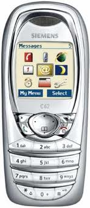

Telecommunication technology has changes our lives in very short time period. Ten years ago, it was not a problem when you can not be contacted at all at any given time. Now, people would rather left their wallet than left their cellphone at home.

Me myself has been using cellphone since 2004. I don't have many cellphones actually, but each of it has very interesting story behind. With this post, I want to keep the stories memorable.

1\. Siemens C62 (2004 - 2006)

My first cellphone, Siemens C62. I bought this one using my commission money from [Mr. Prof. R.J. Widodo](http://rjwidodo.blogspot.com "Prof. R.J. Widodo") for helping him arranging international conference on Control Systems in my 3rd year at ITB. I worked for this event with my two other friends: Ari Pribadi and Dzikri Hakam.

**GENERAL**

[2G Network](http://www.gsmarena.com/network-bands.php3)

GSM 900 / 1800 / 1900

[Announced](http://www.gsmarena.com/siemens_c62-540.php)

2003, 4Q

[Status](http://www.gsmarena.com/siemens_c62-540.php)

Discontinued

**SIZE**

[Dimensions](http://www.gsmarena.com/siemens_c62-540.php)

101 x 44 x 20 mm, 82 cc

[Weight](http://www.gsmarena.com/siemens_c62-540.php)

85 g

**DISPLAY**

[Type](http://www.gsmarena.com/glossary.php3?term=display-type)

CSTN, 4096 colors

[Size](http://www.gsmarena.com/siemens_c62-540.php)

128 x 128 pixels, 7 lines

\- Navi key

**SOUND**

[Alert types](http://www.gsmarena.com/glossary.php3?term=call-alerts)

Vibration; Downloadable polyphonic ringtones

[Speakerphone](http://www.gsmarena.com/glossary.php3?term=loudspeaker)

Yes

**MEMORY**

[Phonebook](http://www.gsmarena.com/glossary.php3?term=phonebook)

50 x 4 fields, 4 contact groups

[Call records](http://www.gsmarena.com/siemens_c62-540.php)

10 dialed, 10 received, 10 missed calls

[Internal](http://www.gsmarena.com/glossary.php3?term=dynamic-memory)

1.6 MB

[Card slot](http://www.gsmarena.com/glossary.php3?term=memory-card-slot)

No

\- 600 KB memory free

\- 100 short messages

\- 100 calendar events

\- Message templates

\- 30 sec voice memo

**DATA**

[GPRS](http://www.gsmarena.com/glossary.php3?term=gprs)

Class 8 (4+1 slots), 32 - 40 kbps

[EDGE](http://www.gsmarena.com/glossary.php3?term=edge)

No

[3G](http://www.gsmarena.com/glossary.php3?term=3g)

No

[WLAN](http://www.gsmarena.com/glossary.php3?term=wi-fi)

No

[Bluetooth](http://www.gsmarena.com/glossary.php3?term=bluetooth)

No

[Infrared port](http://www.gsmarena.com/glossary.php3?term=irda)

No

[USB](http://www.gsmarena.com/glossary.php3?term=usb)

**CAMERA**

No

**FEATURES**

[Messaging](http://www.gsmarena.com/glossary.php3?term=messaging)

SMS, EMS, MMS, Email

[Browser](http://www.gsmarena.com/glossary.php3?term=browser)

WAP 1.2.1

[Radio](http://www.gsmarena.com/glossary.php3?term=fm-radio)

No

[Games](http://www.gsmarena.com/glossary.php3?term=mobile-games)

2 - Achevo, Falling

[Colors](http://www.gsmarena.com/siemens_c62-540.php)

3 - Eagle White, Pidgeon Blue and Cherry Red

[GPS](http://www.gsmarena.com/glossary.php3?term=gps)

No

[Java](http://www.gsmarena.com/glossary.php3?term=java)

No

0

\- Organizer

\- Voice memo

\- Optional digital camera (VGA 640 x 480)

**BATTERY**

Standard, Li-Ion 630 mAh (EBA-610)

[Stand-by](http://www.gsmarena.com/glossary.php3?term=stand-by-time)

Up to 250 h

[Talk time](http://www.gsmarena.com/glossary.php3?term=talk-time)

Up to 4 h 30 min

This phone was a luxury back then. Color screen, polyphonic tone, MMS, GPRS (never use it though, very expensive), no 3G but support (3G handsets back then was kind of "elite-people-only" gadget). Very proud to use it, furthermore I bought it using my very first money earned.

But the end of the story is quite bad. Because I only use this phone in "passive mode" - meaning only to receive SMS and - in very rare moment - receive calls, I always put this phone in my backpack. So it was being pickpocket-ed (how to say "kecopetan" in English??) in an Angkot (how to say "angkot" in English??) one day\*sigh\*. Not a happy ending.

My second cellphone is the sexy Motorola V3 RAZR.

I will write about it in my next post, stay tuned ^\_\_\_^
