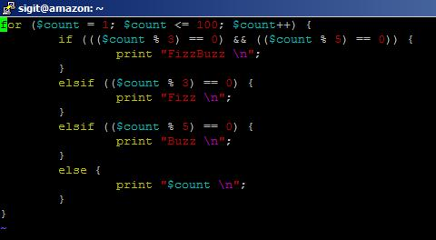

This post title I took from [http://imranontech.com/2007/01/24/using-fizzbuzz-to-find-developers-who-grok-coding/](http://imranontech.com/2007/01/24/using-fizzbuzz-to-find-developers-who-grok-coding/). Nice test that makes me want to try it. Basically here's the test:

> Write a program that prints the numbers from 1 to 100. But for multiples of three print “Fizz” instead of the number and for the multiples of five print “Buzz”. For numbers which are multiples of both three and five print “FizzBuzz”.

So, I log in into inet0.net machine and begin scripting in perl.

\[caption id="attachment\_265" align="aligncenter" width="480" caption="fizzbuzz"\]\[/caption\]

Then I run it, voila!

sigit@amazon:~$ perl fizzbuzz.pl
1
2
Fizz
4
Buzz
Fizz
7
8
Fizz
Buzz
11
Fizz
13
14
FizzBuzz
16
17
Fizz
19
Buzz
Fizz
22
23
Fizz
Buzz
26
Fizz
28
29
FizzBuzz
31
32
Fizz
34
Buzz
Fizz
37
38
Fizz
Buzz
41
Fizz
43
44
FizzBuzz
46
47
Fizz
49
Buzz
Fizz
52
53
Fizz
Buzz
56
Fizz
58
59
FizzBuzz
61
62
Fizz
64
Buzz
Fizz
67
68
Fizz
Buzz
71
Fizz
73
74
FizzBuzz
76
77
Fizz
79
Buzz
Fizz
82
83
Fizz
Buzz
86
Fizz
88
89
FizzBuzz
91
92
Fizz
94
Buzz
Fizz
97
98
Fizz
Buzz
sigit@amazon:~$
