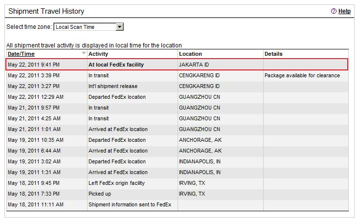
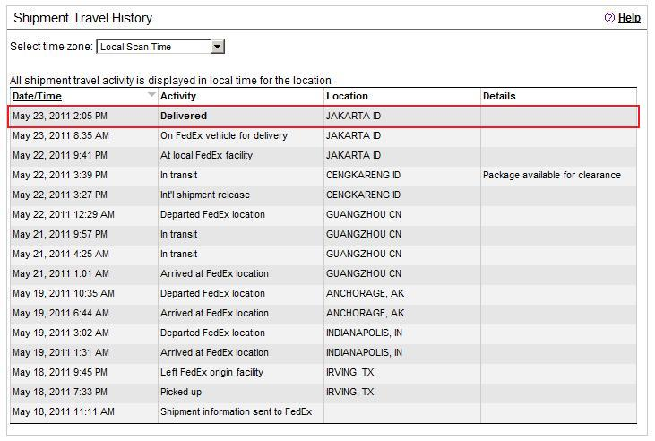
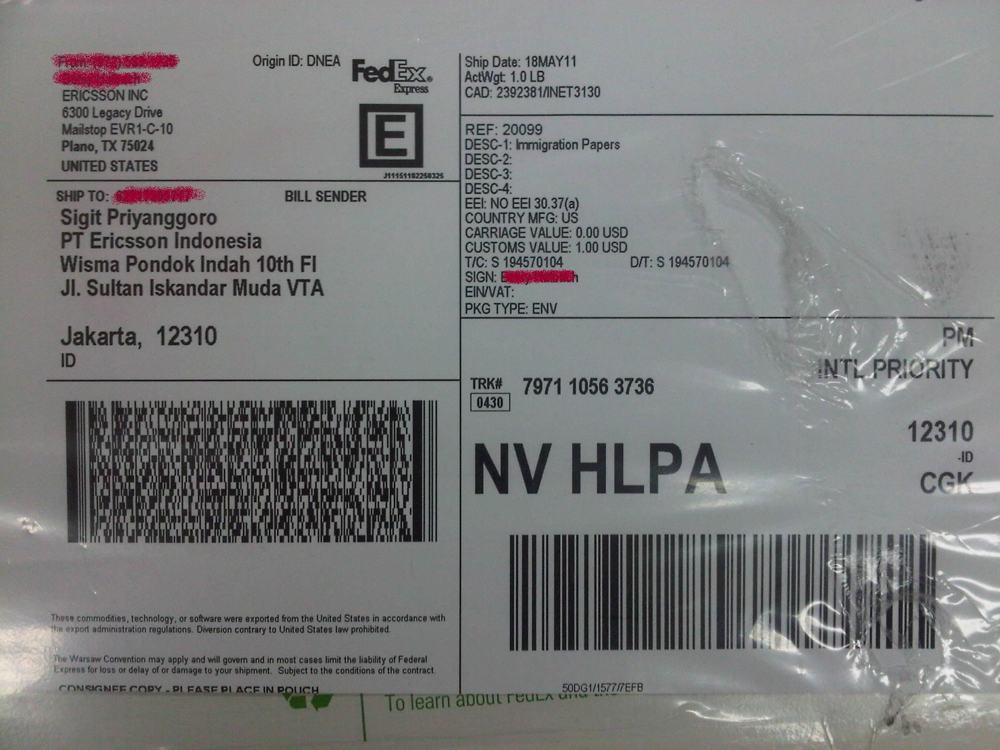

I just checked the Fedex tracking system, seems that one of two documents required already arrives.

Hope the other requirement will also be fine, if not then I have to take the other option.

UPDATE:

The packet:

