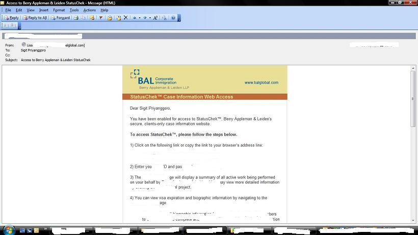

Bismillah, akhirnya proses permanent residency dimulai. Lawfirm yang dipake Ericsson adalah Berry Appleman & Leiden ([http://www.balglobal.com/](http://www.balglobal.com/)). Let's see berapa lama sampai bisa dapet Permanent Resident/Green Card, karena untuk negara-negara kayak China dan India, bisa sampe 7 - 10 tahun.

UPDATE: konfirm sama Mba Lawyer and si Boss kalo ane dapetnya [EB2](http://www.uscis.gov/portal/site/uscis/menuitem.eb1d4c2a3e5b9ac89243c6a7543f6d1a/?vgnextoid=816a83453d4a3210VgnVCM100000b92ca60aRCRD&vgnextchannel=816a83453d4a3210VgnVCM100000b92ca60aRCRD "EB2 Green Card")
