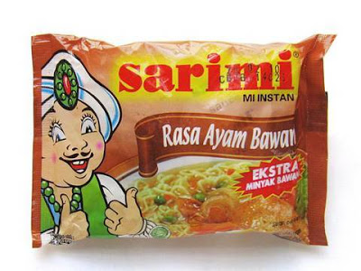
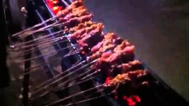

Lagi bosen di ruang kuliah, iseng nulis begini :D

Beberapa Hal Yang Saya Ngalamin Tapi Jaman Sekarang Makin Jarang Dialamin. Atau bahkan di jaman gw pun jarang dialamin orang lain ;)

- Sekolah SD, rumah di Panghegar, SD di Pangaritan. Pergi: jalan 1 Jam, Pulang: jalan 1 jam, mangkanya nih betis cocok buat pemain bola. Anak sekarang dah jarang sekolah jalan, kecuali di pedalaman. Hari pertama sekolah berangkat jalan di anter Bapa. Pulangnya langsung sendiri, nyasar-nyasar kelas 1 SD jalan 1 jam lebih, untung masih bisa pulang hehehe. Tough kid I am.

Waktu SMP pun sering jalan dari Panghegar ke Ujung Berung karena angkot mahal, sejam an juga satu arah.

Rumah-SD:

Rumah-SMP:

- Supermie dan Indomie itu mewah. Dulu paling makan Sarimi. Itupun jarang, pernah numpahin Sarimi waktu SD dimarahin habis-habisan saking mahalnya.

- Nyetrika pake setrika arang, arangnya sering loncat-loncat karena meletup. Kalau loncat ke baju, bajunya bolong.

- Jemur batre radio di atap. Harapannya batre nya ke isi lagi gak mesti beli. Kadang-kadang it works!

- Makan sate di rumah nenek di Garut, unik. Sate dagingnya dicabutin, seorang satu daging bagi-bagi sama sepupu. Jadi satu tusuk buat makan 5 orang. Makan sate gak setaun sekali, makanya tetep seneng banget.

- Ngala Monyet. Sama kakek di Garut ikut kerja perang dengan hama kebun jagung punya orang. Hama nya monyet, bawa golok kita jeblog-jeblog di sawah.

- Ngadu muncang. Muncang A dan muncang B di taruh timpa-timpaan, terus dipalu dari atas, yang pecah muncangnya kalah. Sering main dengan tukang Ojek waktu SD di Pangaritan.

- Ngala muncang di Garut. Main ke kuburan karena muncang banyak tumbuh di kuburan. Ngadu muncang dapet beli mah MAINSTREAM. Ngadu muncang meunang ngala di kuburan: EPIC!

- Waktu SMP an Bapa kerja di Jakarta, pulang ke Bandung seminggu sekali. Kadang kalau habis gajian and pulang ke Bandung, Bapa nyuruh beli makanan mewah: pilih antara Sate atau Martabak telor.

Saya dan adik saya: Tiara (SD) & Delin (belum sekolah) jalan ke Jalan Panghegar beli sate 10 tusuk.

Mungkin jaman sekarang 10 tusuk buat satu orang, tapi dulu jaman gw SMP buat sekeluarga (5 orang, Adit belum lahir).

Tapi senengnya minta ampun, makan pake Nasi, nasinya di rumah,

gak pake lontong karena itu add on sales mahal euy,

sate seorang dua tusuk, bumbunya paling penting karena bikin nasi enak.

- Minum Orson pas lebaran di rumah nenek di Garut. Pas lebaran aja, itupun sebotol dibagi-bagi. Mahal itu Orson.

- Lagi ee ada biawak keluar dari lubang WC waktu rumah di Garut (masih TK, SD sudah di Bandung).

- Sampai kuliah tingkat 1 gak pernah pegang komputer. Ke rumah temen gw, Hilmi, gw disuruh matiin komputer, gak tau caranya :D gw colok langsung tuh tombol power, kemudian kang Hilmi datang dengan tampang kecewa, beliau gak berani komentar hehehe, sorry kang.

- Basket itu olahraga orang gedongan. Sorry kalo gw gak pernah mau diajak main basket, gak bisa. Soalnya basket itu perlu ring, perlu lapang rata. Gak pernah nemu lapang begitu. Di SMA sih ada cuma anak-anak gaul doang yang ikutan basket. Kalau mengbal sih sering, di lapang kebo, kalo kebo nya gak lagi make, kita pake buat mengbal.

- Ngala suluh. Boro-boro kompor minyak, di Garut dulu pake kompor halu. Dari tanah liat dibentuk kompor, pake tiupan dari bambu kalo mau masak biar apinya nyala. Suluh/kayu bakar nya ngala di kebon bareng sepupu dan aki, bawa golok dan karung. Suluh selalu ditumpuk dipinggir rumah.

- Kompor minyak pake sumbu. Sering banget pake ini buat masak, kompor gas baru liat pas SMP-an. Gw ahlinya ganti sumbu kompor. Ada yang bisa juga?

Di comlabs setelah gw memberanikan diri pegang komputer, besoknya banyak tulisan ditempel: Cara mematikan komputer: Start > Shutdown (cukup yakin ini gara-gara gw). Akhirnya gw tau cara matikan komputer. Ini tingkat 1 TPB ya, ada juga anak ITB gak tau komputer. Email pun baru punya kuliah tingkat 1

- Apalagi ya...ntar kalau kepikir lagi tak tambahin

yok mari
