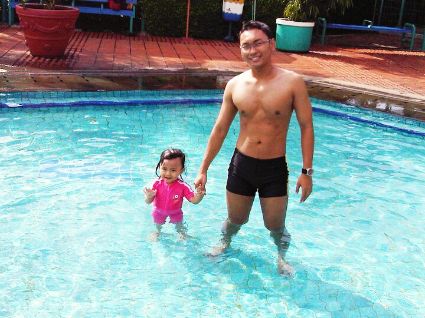
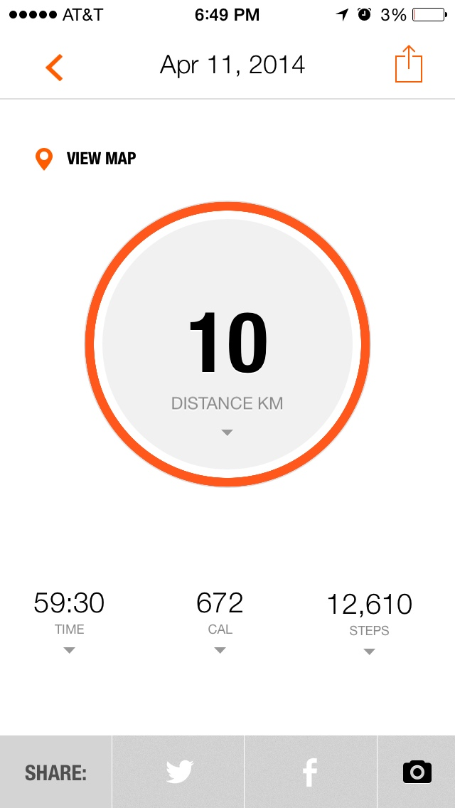

Triggered by overweight verdict during EOY 2008 medical check up, I started running for 30 minutes daily (on weekdays) at a gym close to Ericsson Indonesia office. At that time running wasn't such a hype as it is Today in Jakarta. Furthermore, running outside the gym considered arguably unhealthy with [certain air condition](http://online.wsj.com/news/articles/SB10000872396390444897304578046713405298742). Though Jakarta air condition Today might have improved well with frequent Car Free Day program.

\[caption id="attachment\_877" align="alignleft" width="186"\] Me in 2009, 25 YR - 89 KG\[/caption\]

 

Every morning I was one of few gym members crushing between 07.00 to 09.00 AM, no crowd at all, very much enjoyable. Few times I went there in the evening due to morning meetings, it was very crowded. As usual for me: choose the "less traveled way", morning time ;)

Now just to be clear, my gym goal was not to make myself bulky muscular like those body builders, so I didn't take any additional fitness nutrition like protein shake, creatine powder, etc. I just wanted to be slim-lean-fit-healthy with just enough definition, thus 30 minutes running and 30 minutes weightlifting (abs, back, chest, a little bit of arms) on weekdays was just perfect. I didn't train my legs, I did explain on [previous blog post](https://sigitp.wordpress.com/2013/02/23/beberapa-hal-yang-saya-ngalamin-tapi-jaman-sekarang-makin-jarang/ "https://sigitp.wordpress.com/2013/02/23/beberapa-hal-yang-saya-ngalamin-tapi-jaman-sekarang-makin-jarang/") that I walk daily for school for almost 9 years, just enough leg training for life :D

Consistently doing those exercises for one year gave me a lot of improvement. Really, the only way to "upgrade" your status from overweight to ideal weight is: running. And of course you have to eat healthy food: low carb, more proteins, no oily food, more fruit and veggies.

\[caption id="attachment\_878" align="alignleft" width="584"\] Me in 2010, 26 YR - 65 KG with Aimee (2 YR)\[/caption\]

I still run up until Today, sometimes just at my office gym treadmill before office hours (usually 2.5 KM/day on weekdays). Sometimes outdoor close to the neighborhood before driving to the office or during lunch time (5 KM track). Just recently I tried to join the hype of sharing running record with social media :P

 

I also enjoy [mountain biking](https://scontent-a-dfw.xx.fbcdn.net/hphotos-ash3/t1.0-9/1238110_10151896973980948_1539385267_n.jpg) and [rock climbing](https://fbcdn-sphotos-a-a.akamaihd.net/hphotos-ak-prn1/t1.0-9/944555_10151641263050948_307580113_n.jpg) with my friends Ericsson Indonesia alumni here in DFW area.

**Conclusion:** if you start to think that it is not OK to be overweight, start run! You can see my result within a year of hard work: 89 KG to 65 KG. **Nothing is impossible, impossible is nothing.**

**Remember that guy that gave up? Neither does  anyone else...**
