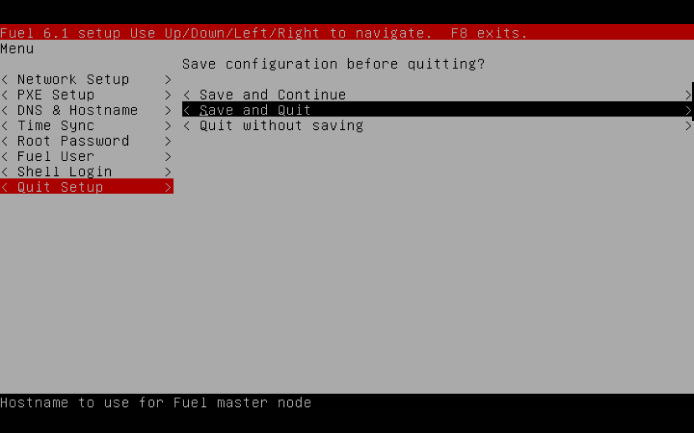

Mirantis Fuel is an Open Source OpenStack cloud based deployment automation tool initially developed by Mirantis. This tool allows deployment of OpenStack cloud within hours (of automated processes) instead of days (of manual CLI scripts).

Fuel currently can deploy Ubuntu and CentOS based OpenStack cloud and has pluggable architecture (version 6.0, 6.1 and onwards) that allows others to build their own customization through plugins.

With the GUI front-end, Fuel can detect bare-metal hardware through L2 PXE boot and assign each hardware into it’s own OpenStack roles (nova, neutron, cinder, controller, etc.). On the back-end Fuel runs on master-less puppet modules where plugins also being built. Fuel will be deployed on Fuel Master node, which can be bare-metal, or VM based machine.

With Hypervisors (VirtualBox, VMWare) Fuel can be deployed on laptop (i7 and 16GB RAM recommended with min 150GB free disk space) for trials and development purposes. The requirements are as follow:

- Hypervisor (Virtualbox, VMWare Fusion). This guide is based on VMWare Fusion on Mac (3 GHz i7, 16GB RAM), but the steps are similar for Virtualbox
- Fuel 6.1 ISO for Fuel Master VM, [download from Mirantis Website](https://software.mirantis.com/openstack-download-form/)
    - (min 41 GB HDD), use 50GB VM Storage, 2 vCPU, 4GB RAM
    - 2 network adapters: 1 for NAT, 1 for host to host/host-only
    - first boot on Fuel ISO
- Node 1 -> for OpenStack Controller VM
    - 50 GB space, 2vCPU, 2GB RAM
    - Empty VM with no OS, OS will be provisioned by Fuel Master, OpenStack role will be deployed by Fuel Master
    - 2 network adapters: 1 for NAT, 1 for host to host/host-only
    - first boot through PXE on eth0
- Node 2 -> for OpenStack Compute VM
    - 50 GB space, 2vCPU, 2GB RAM
    - Empty VM with no OS, OS will be provisioned by Fuel Master, OpenStack role will be deployed by Fuel Master
    - 2 network adapters: 1 for NAT, 1 for host to host/host-only
    - first boot through PXE on eth0
- Connectivity from all 3 VM to Internet (Ubuntu Repo and Mirantis OpenStack Repo). Make sure proxy allows apt-get, yum, git to work.

Network Topology for the 3 VMs:

Note that Fuel Master and the bare-metal nodes for OpenStack deployment have to be in the same L2 network.

Configuring Fuel Master Node

First boot Fuel ISO into the Hypervisor, the node will boot into Fuel Menu configuration to configure interfaces, IP Addresses, DNS, NTP, Gateway. Note that Fuel Master will be the DHCP and TFTP server for PXE booting.

Any configuration changes on Fuel Master can’t be done by manual CLI, it has to be done from this Fuel Menu. This menu can be invoked manually by doing /usr/bin/fuelmenu command.

Use arrows to move cursor and space to choose menu. Screenshots with explanations below:

eth0 will be used as PXE boot interface, the IP above are default values that can be used for our lab. The gateway is 172.16.141.2 which is VMWare Fusion’s VMNET8 NAT IP gateway.

eth1 uses 172.16.141.3 since it is on the range of VMWare Fusion’s NAT IP, the gateway will be 172.16.141.2 since it is the NAT IP gateway of VMWare Fusions VMNET8 interface range.

PXE Setup uses default values, these IP pool will be allocated to the nodes/VMs for OpenStack deployment.

Standard configuration for DNS, here Google’s public DNS is used

Standard NTP configuration, here public ntp.org server is used

enter your root password for your Fuel Master node

Enter your Fuel User username and password; this login will also be used for GUI Fuel login

Skip this shell login step

Save and Quit to start Fuel Node configuration and installation.

\--------------- To be continued to Part2
