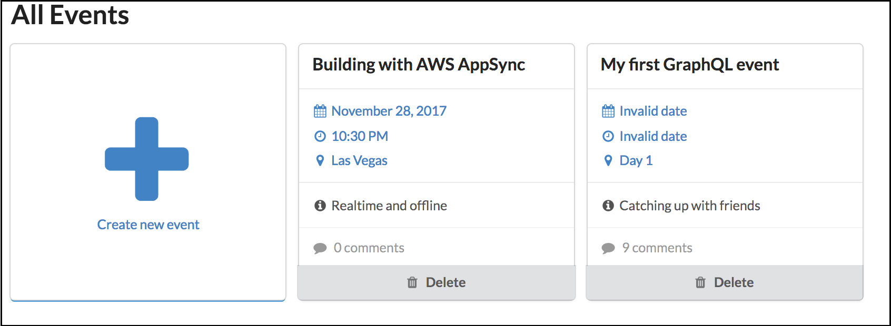
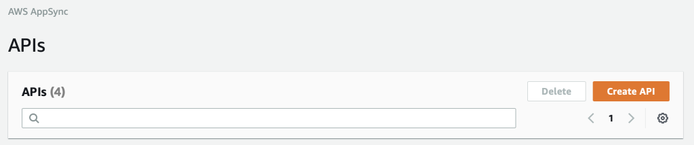
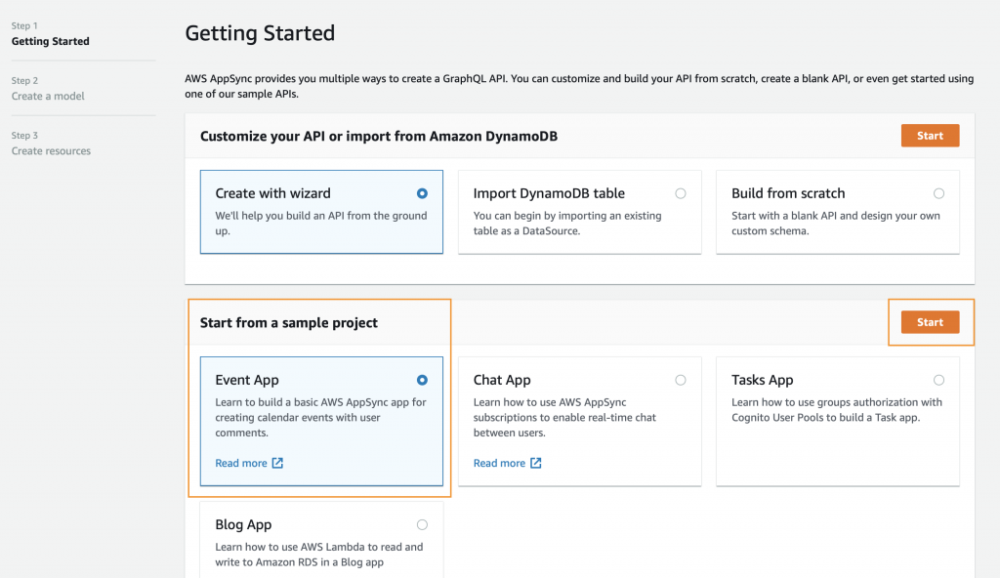
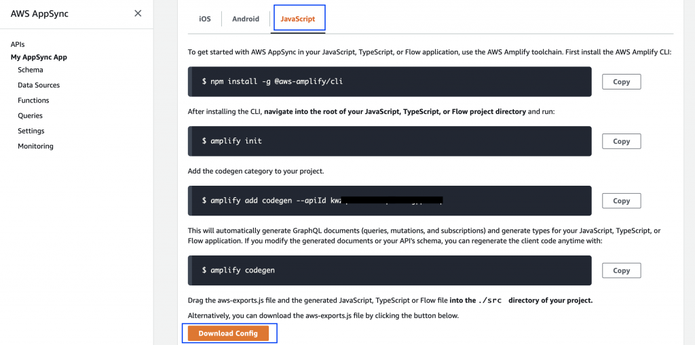
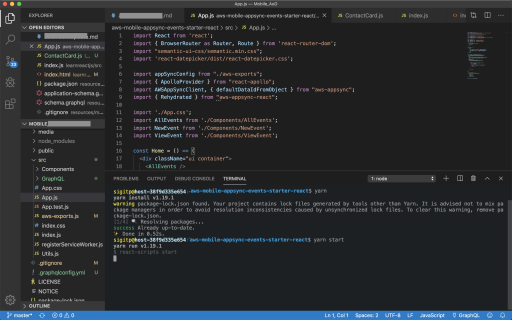
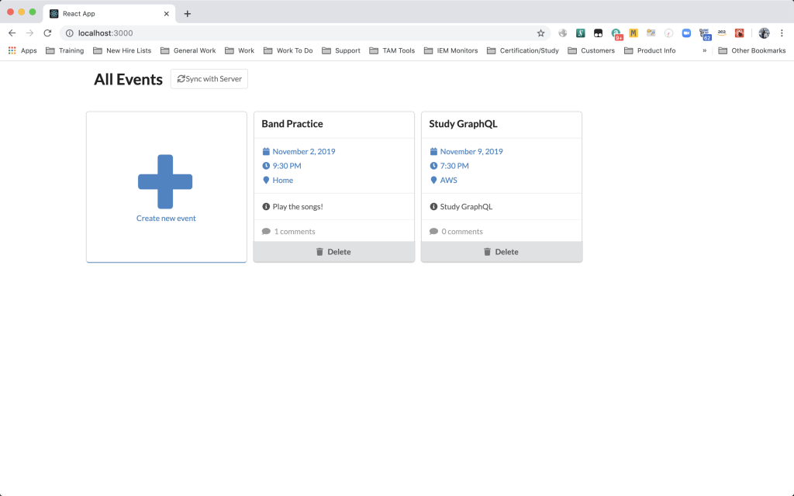
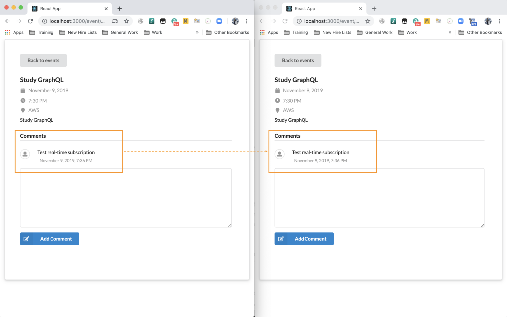

[AWS AppSync](https://aws.amazon.com/appsync/) and [AWS Amplify](https://aws.amazon.com/amplify/) makes it easy for anyone to build Web Application (or iOS/Android Applications) without having to manage the underlying infrastructure. Developers can focus on building their front-end web application while AppSync and Amplify handles the heavy-lifting on the backend infrastructure side.

AppSync is basically a managed [GraphQL](https://graphql.org) infrastructure service. GraphQL provides simple API to do queries, mutations (data change), and subscriptions (following real-time data changes without browser refresh).

Amplify provides set of tools, CLI, and libraries to provision and manage AWS resources as backend infrastructure without having to leave your favorite code editor. Developers just have to execute some commands to include authentication module, upload resources to hosting infrastructure, and other use cases.

On this blog post, I will use a sample Event Application ([https://github.com/aws-samples/aws-mobile-appsync-events-starter-react](https://github.com/aws-samples/aws-mobile-appsync-events-starter-react)) as Web Application Front-end. This sample application is based on ReactJS Javascript framework.



Sample ReactJS front-end application

## Setting Up Backend Infrastructure

**Step 1. Login to AWS AppSync Console**

With your AWS Account credentials, go to: [https://console.aws.amazon.com/appsync/home](https://console.aws.amazon.com/appsync/home) then select **Create API** button.



**Step 2. Create GraphQL API**

Choose **Start from a sample project: Event App** and then click **Start** button.



Name the API, for example: **My AppSync App**. Note that the DynamoDB tables (Event and Comment tables), GraphQL Schema and Resolver script will be created automatically.

DynamoDB tables will be used to store the application data.

GraphQL Schema will be used by our application to do queries, mutations, and subscriptions. You can write the schema definition during API creation and AppSync will translate your schema into DynamoDB tables automatically as well.

Resolver will be used to translate GraphQL API transactions into relevant DynamoDB queries. Resolver is written using [Apache Velocity Template Language](https://velocity.apache.org/engine/2.0/vtl-reference.html).

Explore all these components inside AppSync console and I suggest to read [AppSync Developer Guide](https://docs.aws.amazon.com/appsync/latest/devguide/welcome.html) to dive deeper.

**Step 3. Download aws-exports.js**

Open your AppSync API Details from the Console, choose **JavaScript** tab, then click the **Download Config** button. It will download **aws-exports.js** file (to my Downloads folder) to be used later during our Front-End Web Application setup.

Skip the **npm** and **amplify** CLI instructions for now, we will do this on the Front-End Web Application setup steps below.



Check if the **aws-exports.js** file downloaded:

```javascript
sigitp@host-38f9d335e654:$ **cd ~/Downloads**

sigitp@host-38f9d335e654:Downloads$ **ls -la | grep aws-exports.js**
-rw-r--r--@  1 sigitp  1896053708   421 Nov  2 21:16 aws-exports.js
```

_Note that AppSync supports native iOS and Android integration. Personally for me, once you familiar with ReactJS, you can expand your knowledge with React Native where your JavaScript code can be compiled into native iOS or Android application. Unfortunately due to my limited workstation disk, I can't simulate iOS/Android app with React Native due to high storage requirement._

## Setting Up Front-End Web Application

Prepare your ReactJS development by installing NPM and NodeJS on your workstation: [https://nodejs.org/en/download/](https://nodejs.org/en/download/)

Verify by executing these two commands:

```javascript
sigitp@host-38f9d335e654:~$ **npm -v**
6.12.0
sigitp@host-38f9d335e654:~$ **node -v**
v12.13.0
sigitp@host-38f9d335e654:~$ 
```

_Optional: setup your IDE, I personally use VS Code:_ [_https://code.visualstudio.com_](https://code.visualstudio.com)

**Step 1. Clone The Front-End Web Application**

```javascript
sigitp@host-38f9d335e654:~$ **git clone https://github.com/aws-samples/aws-mobile-appsync-events-starter-react.git**

sigitp@host-38f9d335e654:~$ **cd ./aws-mobile-appsync-events-starter-react**

Next, install Amplify CLI, this step only need to be done once, you don't need to install it again if you want to create new application.

sigitp@host-38f9d335e654:$ **npm install -g @aws-amplify/cli
```

Now, lets initiate Amplify, setup Back-End GraphQL API integration with our Front-End Web Application.

```javascript
sigitp@host-38f9d335e654:$ **cd aws-mobile-appsync-events-starter-react**

sigitp@host-38f9d335e654:aws-mobile-appsync-events-starter-react$ **amplify init**

sigitp@host-38f9d335e654:aws-mobile-appsync-events-starter-react$ **amplify add codegen --apiId <yourapihashkeys>**

sigitp@host-38f9d335e654:aws-mobile-appsync-events-starter-react$ **amplify codegen
```

To ensure our sample Front-End Web Application can communicate with our previously configured Back-End, replace the **aws-exports.js** file inside the **src** directory with the downloaded **aws-exports.js** _(on Step 3 of Backend Setup done previously, located on my Downloads folder)_.

```javascript
sigitp@host-38f9d335e654:aws-mobile-appsync-events-starter-react$ **cp ~/Downloads/aws-export.js ./src/**

sigitp@host-38f9d335e654:aws-mobile-appsync-events-starter-react$ **cd src/**

sigitp@host-38f9d335e654:aws-mobile-appsync-events-starter-react/src$ **ls -la | grep aws-exports.js**
-rw-r--r--@  1 sigitp  1896053708   421 Nov  2 21:16 aws-exports.js
```

**Step 2. Start Front-End Web Application Locally**

```javascript
sigitp@host-38f9d335e654:aws-mobile-appsync-events-starter-react$ **yarn**

sigitp@host-38f9d335e654:aws-mobile-appsync-events-starter-react$ **yarn start
```

Above commands will install application packages and compile the code to run on your local workstation.



**Step 3. Test Front-End Web Application Locally**

With VS Code, once the application packages installed and compiled, your default browser will be automatically opened with [http://localhost:3000/](http://localhost:3000/) where the application runs.

Test by adding events into the application.



**Step 4. Test Real-Time Subscription**

Since we added Real-Time Subscription for Comments on the AppSync GraphQL Schema, we should be able to test it by launching two browsers side-by-side.

Open one of the event on both browsers, add Comment to the browser on the left-hand-side, you will notice that comment will be added to the browser on the right-hand-side without refreshing the browser.



### Summary

We have learned the basics of [AWS AppSync](https://aws.amazon.com/appsync/) and [AWS Amplify](https://aws.amazon.com/amplify/), which makes it easy for anyone to build Web Application without having to manage the underlying infrastructure. Anyone can focus on building their front-end web application while AppSync and Amplify handles the heavy-lifting on the backend infrastructure side.

We also explored a simple ReactJS based Front-End Web Application which utilizes [AWS AppSync](https://aws.amazon.com/appsync/) and [AWS Amplify](https://aws.amazon.com/amplify/) capabilities.

* * *

[Disclaimer](https://www.sigit.cloud/disclaimer/)
