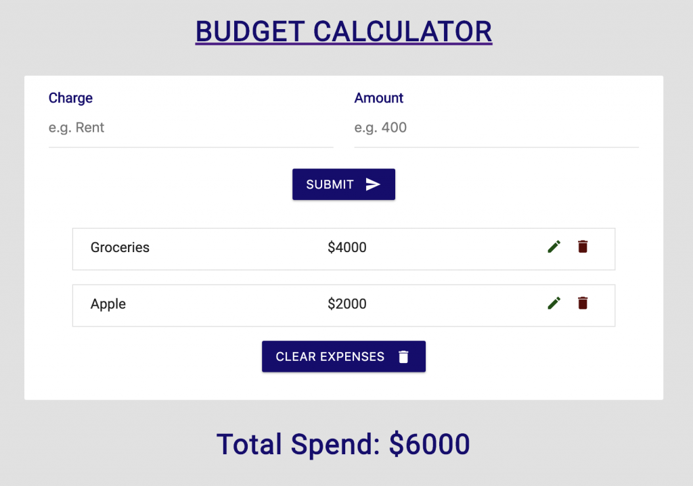
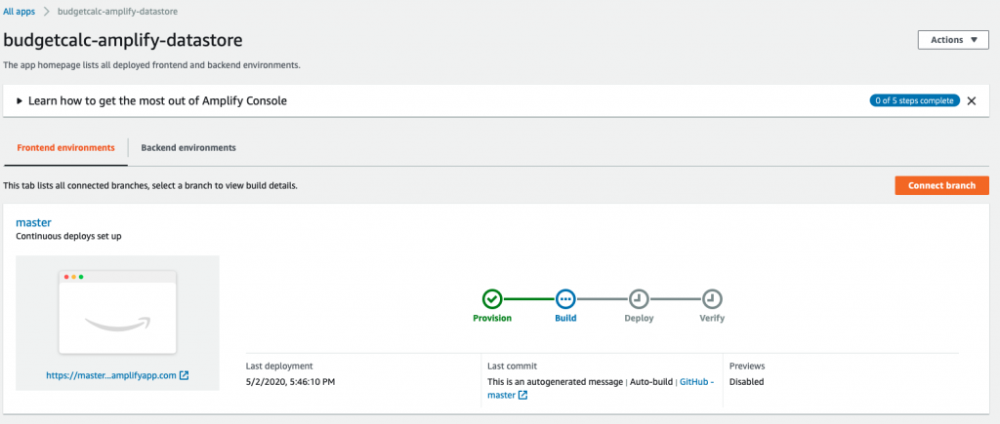
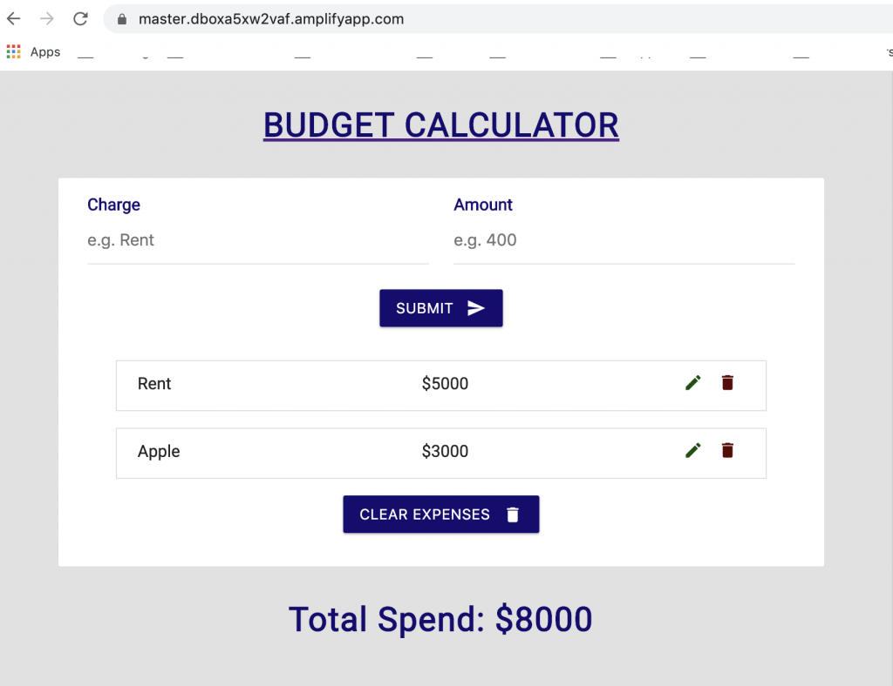
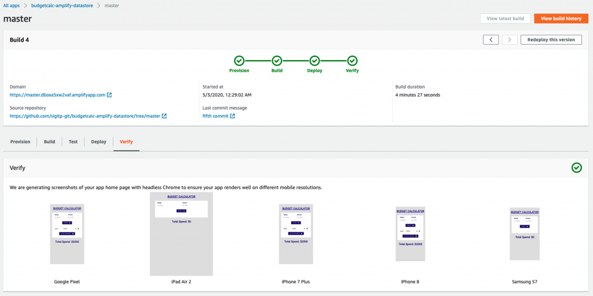

Example of running App: [https://master.dboxa5xw2vaf.amplifyapp.com/](https://master.dboxa5xw2vaf.amplifyapp.com/)



Example of Running App

**[Amplify DataStore](https://aws-amplify.github.io/docs/js/datastore)** is a persistent on-device storage repository for developers to write, read, and observe changes to data. 

Amplify DataStore allows developers to write apps leveraging distributed data without writing additional code for offline or online scenario. 

[Amplify DataStore](https://aws-amplify.github.io/docs/js/datastore) can be used as a stand-alone local datastore in web and mobile applications, with no connection to the cloud, or the need to have an AWS Account.

However, when used with a cloud backend, Amplify DataStore transparently synchronizes data with an [AWS AppSync](https://aws.amazon.com/appsync/) API when network connectivity is available. 

Amplify DataStore automatically versions data, implements conflict detection and resolution in the cloud using [AppSync](https://aws.amazon.com/appsync/). The toolchain also generates object definitions for my programming language based on the GraphQL schema developers provide.

This tutorial describes simple data manipulation on Amplify DataStore as described here: [https://docs.amplify.aws/lib/datastore/data-access/q/platform/js](https://docs.amplify.aws/lib/datastore/data-access/q/platform/js).

These code snippets are the main Amplify DataStore interaction between Front-End React.JS and Amplify Datastore: **Query, Save, Delete, Update, and Delete All.**

```javascript
// Amplify Datastore Functions
async function listExpenses() {
const expenses = await DataStore.query(Expense, Predicates.ALL);
setExpenses(expenses);
}

async function addExpense (id) {
await DataStore.save(new Expense({id: uuidv4(), charge: charge, amount: amount}))
}

async function removeExpense(id) {
const toDelete = await DataStore.query(Expense, id);
DataStore.delete(toDelete);
}

async function updateExpense(id) {
const toUpdate = await DataStore.query(Expense, id);
await DataStore.save(Expense.copyOf(toUpdate, updated => {updated.charge = charge; updated.amount = amount}))
}

const clearItems = () => {
//console.log("cleared!")
//setExpenses is a function(), feed empty array\[\]
setExpenses(\[\])
DataStore.delete(Expense, Predicates.ALL)
handleAlert({type: "danger", text: "items cleared"})
}

useEffect(() => {listExpenses()}, \[expenses\])
```

Follow below step-by-step approach to reproduce the App and learn.

## Prerequisite:

Install Amplify CLI

```javascript
npm i -g @aws-amplify/cli
```


## [](https://github.com/sebsto/amplify-datastore-js-e2e#create-a-new-react-app)Create a new react app, clone from the repository

```javascript
git clone https://github.com/sigitp-git/budgetcalc-amplify-datastore.git

cd budgetcalc-amplify-datastore
```


## [](https://github.com/sebsto/amplify-datastore-js-e2e#add-datastore-to-your-app)Add DataStore to your app

Add support for datastore, it creates the API for you (there is no need to type `amplify add api` after this)

```javascript
npx amplify-app
```


## [](https://github.com/sebsto/amplify-datastore-js-e2e#add-our-graphql-schema)Check GraphQL schema here

```javascript
cat amplify/backend/api/amplifyDatasource/schema.graphql

type Expense @model {
id: ID!
charge: String!
amount: String!
```


## [](https://github.com/sebsto/amplify-datastore-js-e2e#add-dependencies)Add dependencies

```javascript
npm i @aws-amplify/core @aws-amplify/datastore 
```


## [](https://github.com/sebsto/amplify-datastore-js-e2e#run-modelgen)Run modelgen

Model-Gen generates code to implement language specific model classes.

```javascript
npm run amplify-modelgen
```

At this stage, you can already use the app in standalone mode. No AWS Account is required. However, you can continue with below steps to utilize cloud backend.

## [](https://github.com/sebsto/amplify-datastore-js-e2e#create-the-cloud-based-backend)Create the cloud-based backend

```javascript
npm run amplify-push
```


## [](https://github.com/sebsto/amplify-datastore-js-e2e#implement--start-the-app)Implement & Start the App

```javascript
# start the app, your browser should open the app at http://localhost:3000
npm start
```


## [](https://github.com/sebsto/amplify-datastore-js-e2e#cleanup)Cleanup

At the end of your test, you can delete the backend infrastructure

```javascript
amplify delete
```

You might need to manually delete two Amazon S3 buckets created. In the [AWS Console](https://s3.console.aws.amazon.com/s3/home), search for the two buckets having `datastore` part of their name.

## Optional: Amplify Console for CI/CD

You can host your app using Amplify Console for CI/CD purposes. First create a repository on Github for example, then commit your changes.

```javascript
yourappfolder$ git init
yourappfolder$ git add .
yourappfolder$ git commit -m "first commit"
yourappfolder$ git remote add origin https://github.com/your-github-login-id/budgetcalc-amplify-datastore.git
yourappfolder$ git push -u origin master

Initiate Amplify Console by using:

amplify add hosting
```


#select using arrow keys, enter
Hosting with Amplify Console (Managed hosting with custom domains, Continuous deployment)

#then select, enter
Continuous deployment (Git-based deployments)

#browser fired up to choose your Github repository, follow the wizard

The following Amplify Console will show



_Amplify Console, Build in Progress..._

Once build and deploy phase completed, Amplify Console will provide URI to your hosted application, for example: [https://master.dboxa5xw2vaf.amplifyapp.com/](https://master.dboxa5xw2vaf.amplifyapp.com/).



_Example of Running App_, Deployed by Amplify Console via commit on GitHub

Every-time you commit your code change to the GitHub master branch, Amplify Console will automatically deploy your change and verify how the App will look on multiple devices.



Amplify Console completed CI/CD pipeline

## References:

[https://aws.amazon.com/blogs/aws/amplify-datastore-simplify-development-of-offline-apps-with-graphql/](https://aws.amazon.com/blogs/aws/amplify-datastore-simplify-development-of-offline-apps-with-graphql/)

[https://aws.amazon.com/blogs/aws/host-your-apps-with-aws-amplify-console-from-the-aws-amplify-cli/](https://aws.amazon.com/blogs/aws/host-your-apps-with-aws-amplify-console-from-the-aws-amplify-cli/)

[https://github.com/sigitp-git/budgetcalc-amplify-datastore.git](https://github.com/sigitp-git/budgetcalc-amplify-datastore.git)

[https://docs.amplify.aws/lib/datastore/data-access/q/platform/js](https://docs.amplify.aws/lib/datastore/data-access/q/platform/js)

[Disclaimer](https://www.sigit.cloud/disclaimer/)
