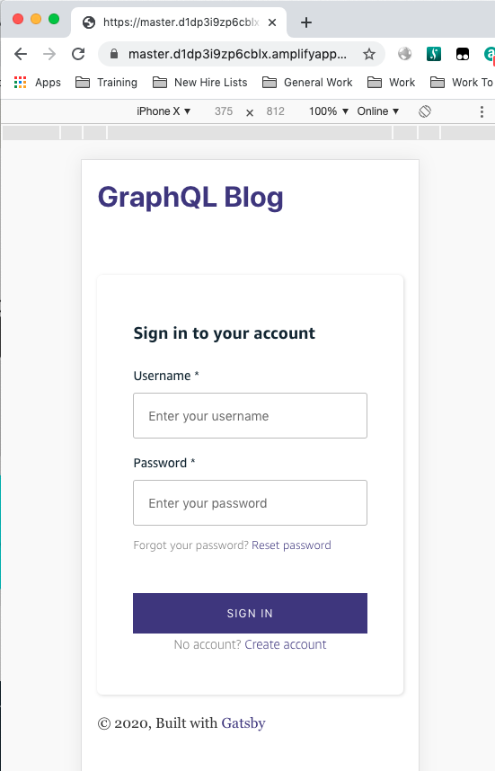

#### Running App Example

Example of running App with customized Amazon Cognito: https://master.d1dp3i9zp6cblx.amplifyapp.com/postblog. This App front-end is based on GatsbyJS/React components. 

You can try to Sign Up and Sign In, it will need valid Phone Number and E-Mail Address. 




#### Code

##### Add Cognito

Add Amazon Cognito support to your App by using Amplify CLI from your App directory as follow:

```shell
prompt$ cd app-directory

prompt$ amplify add auth 
(just try default options for now)

prompt$ amplify push 
(pushing your Cognito configuration to AWS back-end using CloudFormation. Cognito User Pools and configuration will be created)
```

##### CSS

https://github.com/sigitp-git/gatsby-appsync-amplify-pub/blob/master/src/components/layout.css 

```css
:root {
  --themeColor: darkslateblue;
  --hoverColor: rgb(105, 95, 171); 
  --amplify-primary-color: darkslateblue;
  --amplify-primary-tint: rgb(39, 39, 151); 
  --amplify-primary-shade: rgb(105, 95, 171);
}
```

The three CSS custom variables above (`--amplify-primary-color, --amplify-primary-tint`, and `--amplify-primary-shade`) overrides default (**orange**) colors from Amplify/Cognito libraries. Check this page for complete list of customizable CSS variables: https://docs.amplify.aws/ui/customization/theming/q/framework/react. 

##### JavaScript/React

https://github.com/sigitp-git/gatsby-appsync-amplify-pub/blob/master/src/pages/postblog.js

```javascript
import "../components/layout.css"
import { AmplifyAuthenticator, AmplifySignOut, AmplifySignIn, AmplifySignUp } from '@aws-amplify/ui-react'

return (
  <Layout>
  <AmplifyAuthenticator>
  {/* <AmplifySignIn headerText="Customize Sign-In Text Here" slot="sign-in" />
  <AmplifySignUp headerText="Customize Sign-Up Text Here" slot="sign-up" /> */}
  
  <div>
  <form id="postblogform" onSubmit={handleSubmit(onSubmit)}>
  <input type="text" placeholder="Post Title" name="posttitle" ref={register({required: "POST TITLE REQUIRED", minLength: {value: 5, message: "TOO SHORT"}})}/><br/>{errors.posttitle && <p>{errors.posttitle.message}</p>}

	<textarea placeholder="Post Content" name="postcontent" rows="10" cols="100" ref={register({required: "POST CONTENT REQUIRED", minLength: {value: 10, message: "TOO SHORT"}})}/> <br/>{errors.postcontent && <p>{errors.postcontent.message}</p>}

	<button style={{"float": "left"}} type="submit" className="btn">Submit <MdSend className="btn-icon"/></button><br/>
  </form>
	</div>
	<div>
  	<AmplifySignOut/>
  </div>
  </AmplifyAuthenticator>
  </Layout>
)
```

Import the CSS file where we define the customization colors earlier with `import "../components/layout.css"`. Also import Amazon Cognito UI components from `@aws-amplify/ui-react: import { AmplifyAuthenticator, AmplifySignOut, AmplifySignIn, AmplifySignUp } from '@aws-amplify/ui-react'`.

We can then call the Amplify UI Components from the return statement of the application: `<AmplifyAuthenticator>, <AmplifySignIn>, <AmplifySignUp>`, and `<AmplifySignOut>`. 

We can also customize the `headerText` for both ` <AmplifySignIn>`, and `<AmplifySignUp>` components.

##### Summary

As you can see, adding Authentication, Sign Up, Sign In, and Sign Out is very easy with Amazon Cognito. AWS handles the backend heavy-lifting to store your user information, SMS/E-Mail based verification, Passwords policy and much more, Happy Coding!

##### Discuss on Dev.to

https://dev.to/sigitp/customize-amazon-cognito-ui-1pl