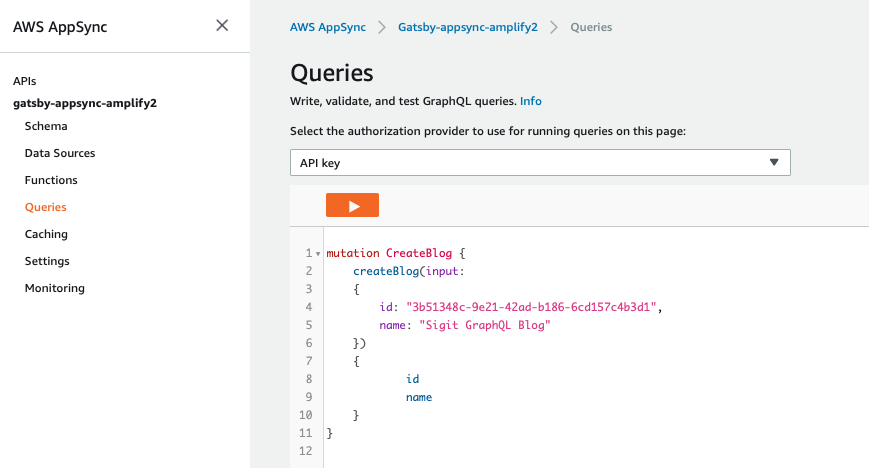

[Gatsby](https://www.gatsbyjs.org/) is a very popular free and opensource framework based on React for developing fast websites and applications. [AWS Amplify](https://docs.amplify.aws/start/q/integration/js) provides an easy way for developers to deploy Gatsby website and application with built-in automated CI/CD pipeline. 

This Blog post will help developers to simplify Gatsby development with AWS Amplify, integrate deployment workflow with GitHub, and utilize [AWS AppSync](https://aws.amazon.com/appsync/) as GraphQL API backend.

## Prerequisites

### Install NodeJS and Node Package Manager (NPM)

You can install NodeJS and NPM on MacOS or Linux by using either Homebrew, or Node Version Manager (NVM.) Windows users can download and install the package published at: https://nodejs.org/ 

### Setting up the Amplify tools

Instructions for installing and configuring the Amplify Command Line tools can be found here: https://docs.amplify.aws/cli/start/install

The instructions will walk you through the process of setting up an AWS Account along with installing and configuring the AWS Amplify command line tools. Once you are done with the installation, return to this post. 

### Install Gatsby

Before you start developing Gatsby websites and applications, setup your Gatsby development environment by following instructions provided in Gatsby documentation: https://www.gatsbyjs.org/tutorial/part-zero/.

### Install Git

This project will require interacting with git source control. You should install a git client, and make sure you have access to Git credentials via HTTPS or SSH. This lab blog post assumes a basic level of familiarity with how to use git and GitHub. 

We will use GitHub to store our code and integrate it with AWS Amplify for automated CI/CD pipeline. Follow GitHub documentation to setup your GitHub account: https://help.github.com/en/github/getting-started-with-github/quickstart

### Setting up GitHub source control

In order to use the Amplify Console later in this process, we will need to have access to GitHub source control repository. This Github repository will serve as the repository for the Amplify CI/CD pipeline. Follow GitHub documentation on how to setup your code repository: https://help.github.com/en/github/getting-started-with-github/create-a-repo

## Creating Gatsby Default Starter Application

Once the previous steps completed, you can initialize your project with gatsby new <project-name> and gatsby develop command, you can see your Gatsby initial project on http://localhost:8000.

 ```shell
user@host:~/$ gatsby new project-name
user@host:~/$ cd project-name
user@host:~/project-name$ gatsby develop
 ```


You can stop Gatsby development server by pressing Ctrl+C on the terminal. The Gatsby default starter application is a great code framework to start developing new application. On this blog post, we will create a new serverless blog project to be deployed with AWS Amplify. 

## Creating Gatsby Blog Project

Once Gatsby starter application running, let’s create a new Gatsby blog project by customizing configuration files and adding code to render the blog list and blog post pages. Let’s clone the blog project so you can start faster with building this application. 

 ```shell
user@host:~/$ git clone https://github.com/sigitp-git/gatsby-appsync-amplify-pub.git
user@host:~/$ cd gatsby-appsync-amplify-pub
user@host:~/gatsby-appsync-amplify-pub$ ls -la
drwxr-xr-x 22 sigitp Group   704 May 15 23:23 .
drwxr-xr-x@ 25 sigitp Group   800 May 18 10:14 ..
-rw-r--r--@ 1 sigitp Group  10244 May 15 23:12 .DS_Store
drwxr-xr-x 13 sigitp Group   416 May 26 22:17 .git
-rw-r--r--  1 sigitp Group   1336 May 14 19:27 .gitignore
-rw-r--r--  1 sigitp Group   315 May 14 19:25 .graphqlconfig.yml
-rw-r--r--  1 sigitp Group    45 May 14 19:25 .prettierignore
-rw-r--r--  1 sigitp Group    46 May 14 19:25 .prettierrc
-rw-r--r--  1 sigitp Group   1076 May 15 21:36 LICENSE
-rw-r--r--@ 1 sigitp Group   5624 May 11 13:09 README.md
-rw-r--r--@ 1 sigitp Group   4322 May 14 23:22 addingdummyposts.graphql
-rw-r--r--@ 1 sigitp Group    54 May 10 12:54 amplify-build-config.json
-rw-r--r--@ 1 sigitp Group   112 May 10 01:03 errafterplugininstallbug
-rw-r--r--  1 sigitp Group   164 May 15 21:36 gatsby-browser.js
-rw-r--r--@ 1 sigitp Group   1296 May 15 10:18 gatsby-config.js
-rw-r--r--@ 1 sigitp Group   820 May 15 22:18 gatsby-node.js
-rw-r--r--  1 sigitp Group   180 May 15 21:36 gatsby-ssr.js
-rw-r--r--  1 sigitp Group 1008314 May 15 22:10 package-lock.json
-rw-r--r--  1 sigitp Group   1807 May 15 22:17 package.json
drwxr-xr-x  7 sigitp Group   224 May 14 17:51 public
drwxr-xr-x 10 sigitp Group   320 May 15 22:19 src
-rw-r--r--  1 sigitp Group  665654 May 15 22:17 yarn.lock
 ```

Build all required packages as required by package.json file using yarn install command.

`user@host:~/gatsby-appsync-amplify-pub$ yarn install`

## Setup Backend Resources with Amplify

Setup backend resources to support to your application by using Amplify CLI with the following commands:

`user@host:~/gatsby-appsync-amplify-pub$ npx amplify-app@latest`

Once the basic setup completes, edit the GraphQL schema located in amplify/backend/api/amplifyDatasource/schema.graphql with the following Blog Application schema:

```javascript
echo "type Blog @model {
 id: ID!
 name: String!
 posts: [Post] @connection(name: "BlogPosts")
}

type Post @model {
 id: ID!
 title: String!
 content: String!
 blog: Blog @connection(name: "BlogPosts")
 comments: [Comment] @connection(name: "PostComments")
}

type Comment @model {
 id: ID!
 content: String
 post: Post @connection(name: "PostComments")
}" > amplify/backend/api/amplifyDatasource/schema.graphql
```

Visit https://docs.amplify.aws/cli/graphql-transformer/overview#create-a-graphql-api for more information about GraphQL schema overview. 

Run modelgen to generate code for your GraphQL transactions: 

`user@host:~/gatsby-appsync-amplify-pub$ npm run amplify-modelgen`

Push your API and Model configuration to Amplify backend. This will push your backend configuration: create Amplify Console App, AppSync API, and DynamoDB tables using CloudFormation.  

`user@host:~/gatsby-appsync-amplify-pub$ npm run amplify-push`

 

## Adding Initial Blog Post using GraphQL Query

Now that we have our Gatsby blog ready, let’s add our initial blog posts using GraphQL query. The blog posts will be stored inside DynamoDB table that was created when you push the backend configuration into your AWS account. Use the following command to initiate your browser into AppSync API console, select GraphQL as your API service. 

`user@host:~/gatsby-appsync-amplify-pub$ amplify console api`

Your browser will open the AppSync GraphQL backend once you logged-in to your AWS account. Open the file addingdummyposts.graphql from the project directory, copy the content and paste it to GraphQL query page, **one query at a time**, you can just create 1 Blog, 1 Post, and 1 Comment for now.

Create blog query, submit the query by clicking on the orange run query button:



Create post query:


 

Create comment query:


 

## Integration Between Gatsby and AppSync

Gatsby uses gatsby-config.js to integrate with AppSync GraphQL API. Open the file gatsby-config.js, edit the values for url and x-api-key with your own data that can be obtained from src/aws-exports.js. 

**aws-exports.js contains secret parameters, make sure you add src/aws-exports.js and gatsby-config.js into .gitignore.**

Below are the configuration used by Gatsby to integrate with AppSync.

 ```javascript
 plugins: [
  `gatsby-plugin-react-helmet`,
  {
   resolve: `gatsby-source-graphql`,
   options: { 
  		typeName: `gatsbyappsync`,
  		fieldName: `gatsbyappsync`,
  		url: `https://randomvalue.appsync-api.us-east-1.amazonaws.com/graphql`,
  		headers: {
  			'x-api-key': 'randomkey'
  		}
   },
  },
 ```

Start the Gatsby development server to check our blog project: 

 ```
user@host:~/gatsby-appsync-amplify-pub$ gatsby develop
You can now view gatsby-starter-default in the browser.
 http://localhost:8000/
View GraphiQL, an in-browser IDE, to explore your site's data and schema
 http://localhost:8000/___graphql
Note that the development build is not optimized.
To create a production build, use gatsby build
⠀
success Building development bundle - 6.080s
 ```

Open both the starter page (http://localhost:8000) and GraphiQL IDE (http://localhost:8000/___graphql)

Using GraphiQL, we can simulate the query to get all of our Blogs, Posts, and Comments, follow the query as follow, click the Run Query button to get the results:

``` javascript
query MyQuery {
 gatsbyappsync {
  listBlogs(limit: 10) {
   items {
    id
    name
   }
  }
  listPosts(limit: 1000) {
   items {
    id
    title
    date
    content
    _lastChangedAt
   }
  }
  listComments(limit: 50) {
   items {
    id
    content
   }
  }
 }
}
```


We can now start to use Gatsby GraphQL query to interact with AppSync API. You can check the gatsby-node.js, index.js, and templates/blog-post.js to see how the GraphQL query utilized inside Gatsby components. You can always test your development by using gatsby develop command, next we will deploy our blog using Amplify Console. 

## Deploying Application with Amplify Console

Now that we have Gatsby default starter application running, we want to publish the application and set up the Amplify Console to host the application.

From the command line, use GIT to publish all of the changes to the GitHub repository.

```shell
user@host:~/project-name$ git init
user@host:~/project-name$ git add .
user@host:~/project-name$ git commit -m “gatsby starter app”
user@host:~/project-name$ git remote add origin https://github.com/%3Cyour-user-name%3E/%3Cyour-project-name%3E.git
user@host:~/project-name$ git push -u origin master
```

Once your code push is completed, login to the AWS Console.

- From the AWS Console,     select AWS     Amplify
- Click on Connect App to     create your new Amplify application and connect it to your source control.
- From the source code     selection option, choose GitHub as     the location for your source control. Then click Continue. Follow     the step by step guide to complete setting up Amplify Console.

Figures below shows the step by step guide provided by Amplify Console:


Add repository branch: 


Select branch master or any other branch that you will deploy in this process: 


 Configure your build settings, use amplify backend that we configured earlier with Amplify CLI:


Once completed, Amplify Console will provision, build, deploy, and verify your application and provides application URL such as: https://master.d1dp3i9zp6cblx.amplifyapp.com/. If you commit a new code to the repository, Amplify will automatically repeat the process for your new application version. 


 You can then open the deployed application in your browser:


## Summary

In this post, we walked you through the creation of a serverless Gatsby blog project using AWS Amplify to integrate our front-end with back-end resources hosted in AWS cloud. We also provided code to integrate Gatsby with AppSync GraphQL API to generate blog posts in our blog project. 

AWS AppSync provides toolkit, libraries, and console to help developers build applications, integrate with GitHub code repositories, and automatically deploy their applications code, directly from the application repositories. 

 

#### Discuss on Dev.to

https://dev.to/sigitp/build-serverless-blog-with-gatsby-and-aws-amplify-1h96