It's much more simple nowadays spinning up Kubernetes cluster with services like EKS, back then when I have to do all things manually, control nodes configuration and deployment takes heavy toll on your "YAML eyes" skills :D 

Now with "Managed node groups", spinning and operating worker nodes also become so much simple!

**What is EKS "Managed node groups"?**

Amazon EKS managed node groups automate the provisioning and lifecycle management of nodes (Amazon EC2 instances) for Amazon EKS Kubernetes clusters.

With Amazon EKS managed node groups, you don’t need to separately provision or register the Amazon EC2 instances that provide compute capacity to run your Kubernetes applications. You can create, update, or terminate nodes for your cluster with a single operation. Nodes run using the latest Amazon EKS optimized AMIs in your AWS account. Node updates and terminations gracefully drain nodes to ensure that your applications stay available.

All managed nodes are provisioned as part of an Amazon EC2 Auto Scaling group that's managed for you by Amazon EKS. All resources including the instances and Auto Scaling groups run within your AWS account. Each node group uses the Amazon EKS optimized Amazon Linux 2 AMI and can run across multiple Availability Zones that you define.

You can add a managed node group to new or existing clusters using the Amazon EKS console, `eksctl`, AWS CLI; AWS API, or infrastructure as code tools including AWS CloudFormation. Nodes launched as part of a managed node group are automatically tagged for auto-discovery by the Kubernetes cluster autoscaler. You can use the node group to apply Kubernetes labels to nodes and update them at any time.

**Building the cluster with eksctl**

[eksctl](https://eksctl.io/) is a tool jointly developed by AWS and [Weaveworks](https://weave.works/) that automates much of the experience of creating EKS clusters. Make sure you have AWS CLI and the right IAM users/roles/permissions to create EKS cluster available, follow [this](https://docs.aws.amazon.com/eks/latest/userguide/getting-started-eksctl.html) guide as prerequisites. eksctl will then create a cluster with ControlPlane and worker nodes as shown below. The number of worker nodes is specified on the cluster definition YAML file.

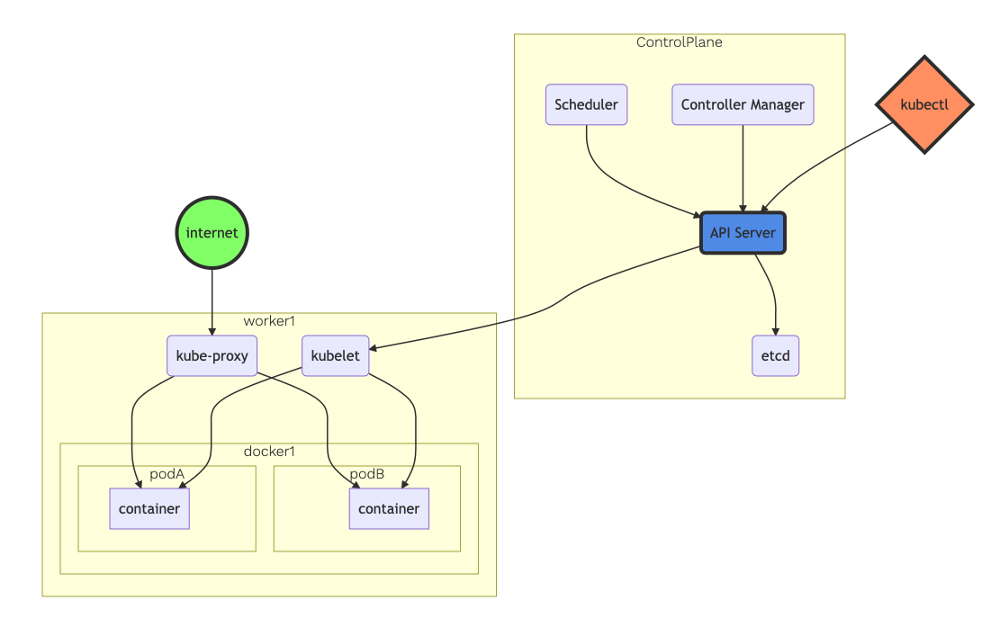

**Cluster definition YAML file**

Create this cluster definition YAML file (clusterdef.yaml) on your local workstation. You can choose your own AWS Region and Availability Zone based on your preference. Use your own AWS Key Management Service (KMS) keys to provide envelope encryption of [Kubernetes secrets](https://kubernetes.io/docs/concepts/configuration/secret/) stored in Amazon Elastic Kubernetes Service (EKS). Implementing envelope encryption is considered a security best practice for applications that store sensitive data and is part of a [*defense in depth* security strategy](https://www.us-cert.gov/bsi/articles/knowledge/principles/defense-in-depth).

```yaml
---
apiVersion: eksctl.io/v1alpha5
kind: ClusterConfig

metadata:
  name: ekscluster-eksctl
  region: us-east-1 

availabilityZones: ["us-east-1a", "us-east-1b", "us-east-1c"]

managedNodeGroups:
- name: managednodegroup
  desiredCapacity: 3
  instanceType: t3.small
  ssh:
    allow: true

cloudWatch:
  clusterLogging:
   enableTypes: ["*"]

secretsEncryption:
  keyARN: arn:aws:kms:us-east-1:1234567890:key/adsfasdfasdf-adsfasdfasdfdsa-asdfasdfasdfasf
```


**Execute the cluster definition YAML file**

Save above file as clusterdef.yaml, then execute the following command:

```shell
eksctl create cluster -f clusterdef.yaml
```

eksctl will handle the heavylifting for you with AWS CloudFormation in the backend:

```shell
(base) yoyoyo@host-38f9d335e654:~/ekscluster$ eksctl create cluster -f ekscluster.yaml
[ℹ]  eksctl version 0.37.0
[ℹ]  using region us-east-1
[ℹ]  subnets for us-east-1a - public:192.168.0.0/19 private:192.168.96.0/19
[ℹ]  subnets for us-east-1b - public:192.168.32.0/19 private:192.168.128.0/19
[ℹ]  subnets for us-east-1c - public:192.168.64.0/19 private:192.168.160.0/19
[ℹ]  using SSH public key "/Users/yoyoyo/.ssh/id_rsa.pub" as "eksctl-ekscluster-eksctl-nodegroup-managednodegroup-9d:d4:ac:0b:ea:7f:07:oo:oo:oo" 
[ℹ]  using Kubernetes version 1.18
[ℹ]  creating EKS cluster "ekscluster-eksctl" in "us-east-1" region with managed nodes
[ℹ]  1 nodegroup (managednodegroup) was included (based on the include/exclude rules)
[ℹ]  will create a CloudFormation stack for cluster itself and 0 nodegroup stack(s)
[ℹ]  will create a CloudFormation stack for cluster itself and 1 managed nodegroup stack(s)
[ℹ]  if you encounter any issues, check CloudFormation console or try 'eksctl utils describe-stacks --region=us-east-1 --cluster=ekscluster-eksctl'
[ℹ]  Kubernetes API endpoint access will use default of {publicAccess=true, privateAccess=false} for cluster "ekscluster-eksctl" in "us-east-1"
[ℹ]  2 sequential tasks: { create cluster control plane "ekscluster-eksctl", 3 sequential sub-tasks: { 2 sequential sub-tasks: { wait for control plane to become ready, update CloudWatch logging configuration }, create addons, create managed nodegroup "managednodegroup" } }
[ℹ]  building cluster stack "eksctl-ekscluster-eksctl-cluster"
[ℹ]  deploying stack "eksctl-ekscluster-eksctl-cluster"
[ℹ]  waiting for CloudFormation stack "eksctl-ekscluster-eksctl-cluster"
.....
[ℹ]  waiting for requested "LoggingUpdate" in cluster "ekscluster-eksctl" to succeed
[✔]  configured CloudWatch logging for cluster "ekscluster-eksctl" in "us-east-1" (enabled types: api, audit, authenticator, controllerManager, scheduler & no types disabled)
[ℹ]  building managed nodegroup stack "eksctl-ekscluster-eksctl-nodegroup-managednodegroup"
[ℹ]  deploying stack "eksctl-ekscluster-eksctl-nodegroup-managednodegroup"
[ℹ]  waiting for CloudFormation stack "eksctl-ekscluster-eksctl-nodegroup-managednodegroup"
[ℹ]  waiting for the control plane availability...
[✔]  saved kubeconfig as "/Users/yoyoyo/.kube/config"
[ℹ]  no tasks
[✔]  all EKS cluster resources for "ekscluster-eksctl" have been created
[ℹ]  nodegroup "managednodegroup" has 3 node(s)
[ℹ]  node "ip-192-168-24-18.ec2.internal" is ready
[ℹ]  node "ip-192-168-54-189.ec2.internal" is ready
[ℹ]  node "ip-192-168-94-142.ec2.internal" is ready
[ℹ]  waiting for at least 3 node(s) to become ready in "managednodegroup"
[ℹ]  nodegroup "managednodegroup" has 3 node(s)
[ℹ]  node "ip-192-168-24-18.ec2.internal" is ready
[ℹ]  node "ip-192-168-54-189.ec2.internal" is ready
[ℹ]  node "ip-192-168-94-142.ec2.internal" is ready
[ℹ]  kubectl command should work with "/Users/yoyoyo/.kube/config", try 'kubectl get nodes'
[✔]  EKS cluster "ekscluster-eksctl" in "us-east-1" region is ready
```

Once the EKS cluster is ready, you can check the worker nodes with below command:

```shell
(base) yoyoyo@host-38f9d335e654:~/ekscluster$ kubectl get nodes
NAME                             STATUS   ROLES    AGE     VERSION
ip-192-168-24-18.ec2.internal    Ready    <none>   2m39s   v1.18.9-eks-d1db3c
ip-192-168-54-189.ec2.internal   Ready    <none>   2m50s   v1.18.9-eks-d1db3c
ip-192-168-94-142.ec2.internal   Ready    <none>   2m53s   v1.18.9-eks-d1db3c
(base) yoyoyo@host-38f9d335e654:~/ekscluster$ 
```


**Worker node group update with EKS Console**

Once your EKS cluster up and running, there are several scenarios where it's useful to update your Amazon EKS managed node group's version or configuration:

- You have updated the Kubernetes version for your Amazon EKS cluster and want to update your nodes to use the same Kubernetes version.
- A new AMI release version is available for your managed node group. For more information about AMI versions, see [Amazon EKS optimized Amazon Linux AMI versions](https://docs.aws.amazon.com/eks/latest/userguide/eks-linux-ami-versions.html).
- You want to adjust the minimum, maximum, or desired count of the instances in your managed node group.
- You want to add or remove Kubernetes labels from the instances in your managed node group.
- You want to add or remove AWS tags from your managed node group.
- You need to deploy a new version of a launch template with configuration changes, such as an updated custom AMI.

If there's a newer AMI release version for your managed node group's Kubernetes version, you can update your node group's version to use the newer AMI version. Similarly, if your cluster is running a Kubernetes version that's newer than your node group, you can update the node group to use the latest AMI release version to match your cluster's Kubernetes version.

> *Note*
>
> You can't roll back a node group to an earlier Kubernetes version or AMI version.
>
> When a node in a managed node group is terminated due to a scaling action or update, the pods in that node are drained first. For more information, see [Managed node update behavior](https://docs.aws.amazon.com/eks/latest/userguide/managed-node-update-behavior.html).

From the AWS Management Console, visit your EKS cluster Compute Configuration. In this example, there is a new update on the Amazon EKS optimized Amazon Linux AMI version:

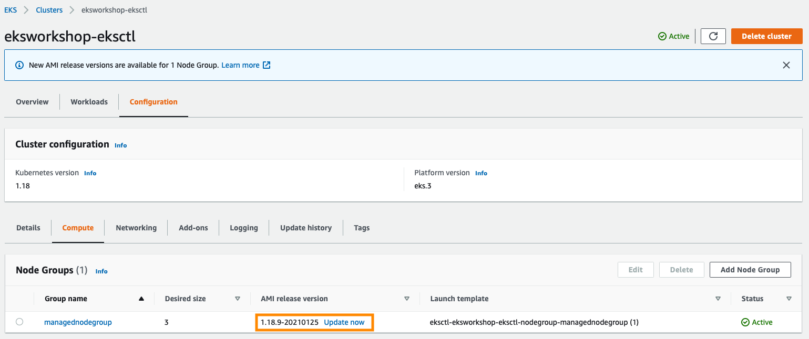


To upgrade the node group, click **Update now**. Select the **Rolling update** option to respect pod disruption budgets for your cluster. The update fails if Amazon EKS is unable to gracefully drain the pods that are running on this Node Group due to a pod disruption budget issue. If you want to change your Launch template (changing AMI, or changing instance type, or modifying tags, for example), you can select the Launch template version here as well.

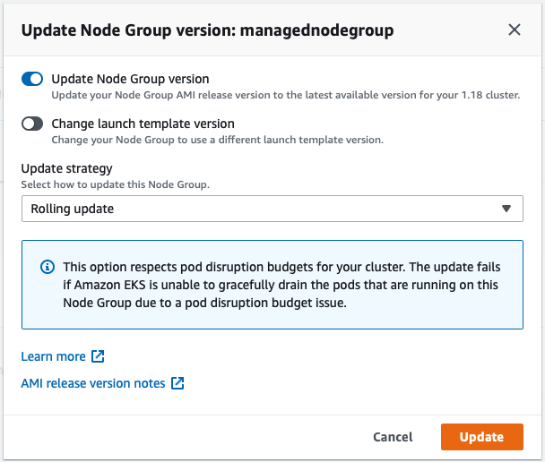


Once you click **Update**, the update process will start with a specific **Update ID**, you can follow the update progress in the AWS Management Console:

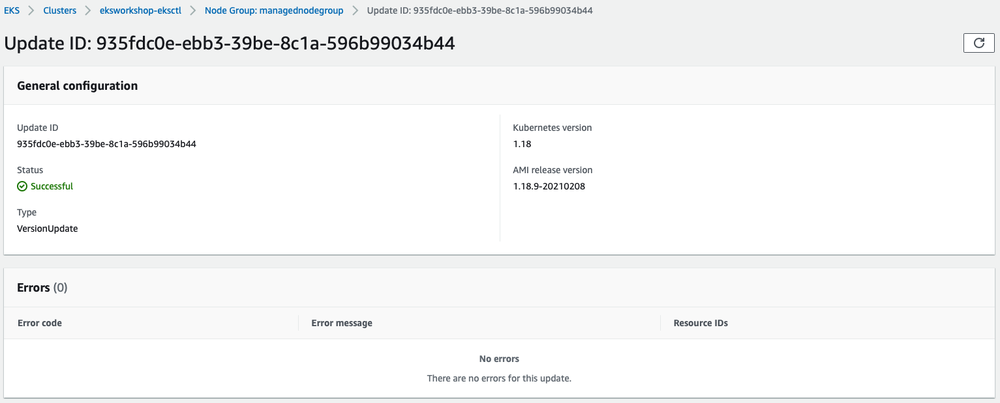

Amazon EKS triggers the [following](https://docs.aws.amazon.com/eks/latest/userguide/managed-node-update-behavior.html) logic during the update:

1. Amazon EKS creates a new Amazon EC2 launch template version for the Auto Scaling group associated with your node group. The new template uses the target AMI for the update.
2. The Auto Scaling group is updated to use the latest launch template with the new AMI.
3. The Auto Scaling group maximum size and desired size are incremented by one up to twice the number of Availability Zones in the Region that the Auto Scaling group is deployed in. This is to ensure that at least one new instance comes up in every Availability Zone in the Region that your node group is deployed in.
4. Amazon EKS checks the nodes in the node group for the `eks.amazonaws.com/nodegroup-image` label, and applies a `eks.amazonaws.com/nodegroup=unschedulable:NoSchedule` taint on all of the nodes in the node group that aren't labeled with the latest AMI ID. This prevents nodes that have already been updated from a previous failed update from being tainted.
5. Amazon EKS randomly selects a node in the node group and evicts all pods from it.
6. After all of the pods are evicted, Amazon EKS cordons the node. This is done so that the service controller doesn't send any new request to this node and removes this node from its list of healthy, active nodes.
7. Amazon EKS sends a termination request to the Auto Scaling group for the cordoned node.
8. Steps 5-7 are repeated until there are no nodes in the node group that are deployed with the earlier version of the launch template.
9. The Auto Scaling group maximum size and desired size are decremented by 1 to return to your pre-update values.

I have **3 nodes with t3.small** instances with lightweight workload, the update process took **~16 minutes**. Learn more [here](https://docs.aws.amazon.com/eks/latest/userguide/update-managed-node-group.html#aws-management-console) on EKS Rolling Update. 

**[Real Life Scenario] Updating EKS cluster to 1.19** (Update 02-18-2021)

Now let's apply learnings from above to upgrade our EKS cluster to [latest 1.19](https://aws.amazon.com/about-aws/whats-new/2021/02/amazon-eks-supports-kubernetes-version-1-19/ ).

[Kubernetes](https://aws.amazon.com/kubernetes/) is rapidly evolving, with frequent feature releases and bug fixes. Highlights of the Kubernetes 1.19 release include [Ingress API](https://kubernetes.io/docs/concepts/services-networking/ingress/) and [Pod Topology Spread](https://kubernetes.io/docs/concepts/workloads/pods/pod-topology-spread-constraints/) reaching stable status, [EndpointSlices](https://kubernetes.io/blog/2020/09/02/scaling-kubernetes-networking-with-endpointslices/) being enabled by default, and immutable [Secrets](https://kubernetes.io/docs/concepts/configuration/secret/#secret-immutable) and [ConfigMaps](https://kubernetes.io/docs/concepts/configuration/configmap/#configmap-immutable). Learn more about Kubernetes version 1.19 in the [Kubernetes project release notes](https://github.com/kubernetes/kubernetes/blob/master/CHANGELOG/CHANGELOG-1.19.md).

First step: upgrade your EKS cluster. In this example, I updated from 1.18

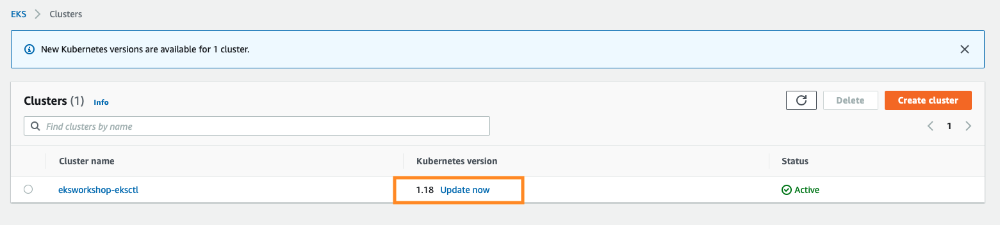

Select 1.19 as target version:

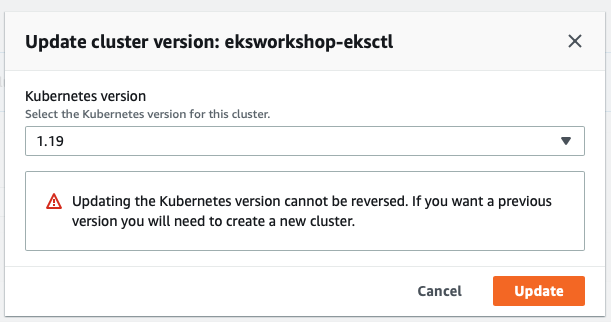

You can check the progress on **Update history** tab:

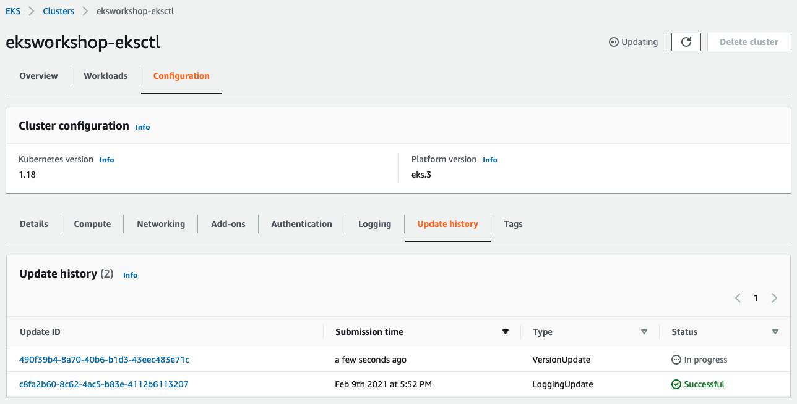

Click the **Update ID** for more details:

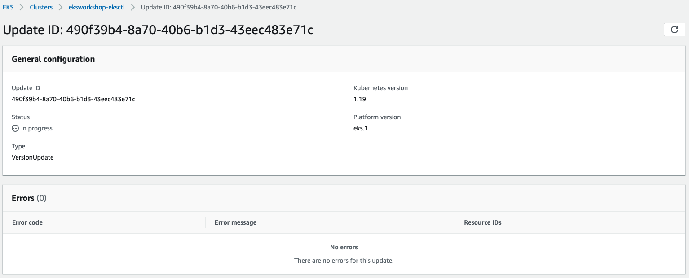

In my cluster, the EKS update completed in **~25 minutes**.

Now we have the EKS control plane on version 1.19, we will have to proceed to update the current managed node group from 1.18 to 1.19 as well:

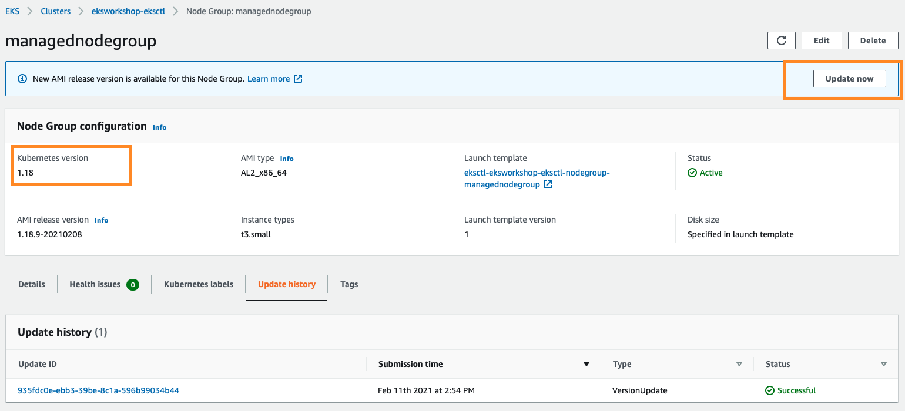

Update the nodegroups into 1.19:

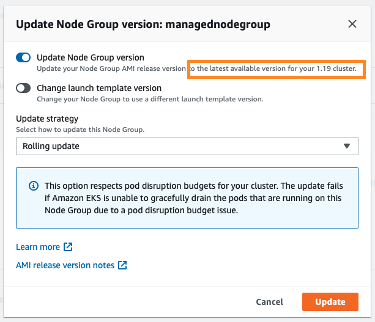

You can follow the progress by looking at the **Update ID**:

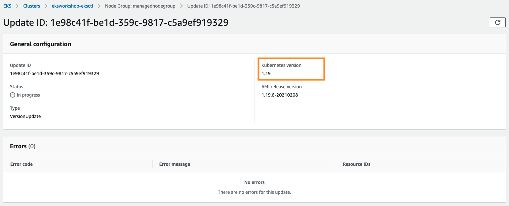

On my nodegroups, it takes **~16 minutes**, the nodegroups consists of **3 nodes with t3.small** instances with lightweight workload. 

With these update steps, now you have EKS 1.19 on both the control plane (manged by EKS) and the worker nodegroups. 

**Summary**

[eksctl](https://eksctl.io/) is a tool jointly developed by AWS and [Weaveworks](https://weave.works/) that automates much of the experience of creating EKS clusters. Once your EKS cluster up and running, there are several scenarios where it's useful to update your Amazon EKS managed node group's version or configuration. The **Rolling update** option to respect pod disruption budgets for your cluster. Remember to always test your cluster update in a sandbox or development environment first before doing it in production. 

**References**

EKS user guide: https://docs.aws.amazon.com/eks/latest/userguide/getting-started.html 

Maximum pods based on Instance type: https://github.com/awslabs/amazon-eks-ami/blob/master/files/eni-max-pods.txt 

Available IP per ENI on Instance type: https://docs.aws.amazon.com/AWSEC2/latest/UserGuide/using-eni.html#AvailableIpPerENI

**Disclaimer**

https://sigit.cloud/disclaimer/

