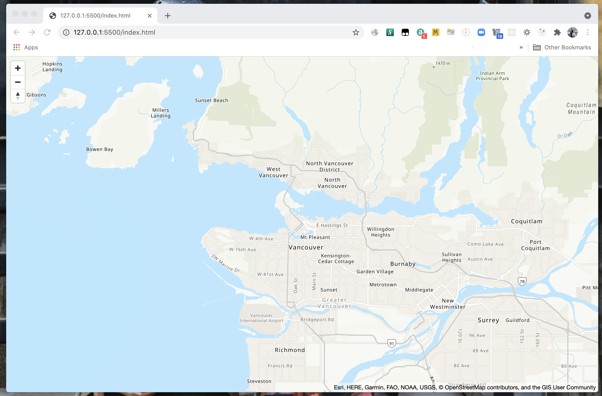

Amazon Location Service makes it easy for developers to add location data to applications without sacrificing data security and user privacy. You can read more about Amazon Location Service [here](https://aws.amazon.com/location/). 

In this blog, I just want to share how to try Amazon Location Service with simple hands-on lab. This blog assumes you have basic AWS services understanding and an AWS account to try stuff. 

[Amazon Location Service is in Preview. During the Preview period, you will not incur Amazon Location Service charges for the use of the service](https://aws.amazon.com/location/pricing/). You may incur fees for the use of other AWS services such as Amazon EventBridge, AWS Lambda, and Amazon CloudWatch.

**Exploring the 4 Amazon Location Service Capabilities: Maps, Place, Geofence, and Tracker**

In this part 1 blog, we will focus on Maps, we will discuss the other three on part 2 of the blog. Let's jump directly by logging in to your AWS account, then select Amazon Location Service, you will see the console as follow:


Use the **Try it!** button to go to the **Explore** page.

**Map**

As simple as it's name, this capability helps you to display map inside your web page or iOS, and Android applications. Maps help you visualize location information and are the foundations of many location-based service capabilities. Amazon Location Service provides map tiles of different styles sourced from global location data providers [Esri](https://aws.amazon.com/location/data-providers/esri/) and [HERE](https://aws.amazon.com/location/data-providers/here-technologies/). 

Access your map from the Menu on the Explore page:


Under the **Manage Resources**, you can see the **Maps** tab.


There is a default map named "**explore.map**" already created with Esri as the data source. You can see more details by clicking the map for more information.

**Creating a new map**

Now let's create a new map by clicking the "**Create map** button, this time, we will use "Here Berlin" as the data source. Here, I name this map as "**here-test**". 


Now we have 2 maps available to try out:


**Loading the maps into HTML page**

Now let's try to load the maps above into a simple HTML page for testing. We are going to use [Amazon Cognito](https://aws.amazon.com/cognito/) for user access control. In this example, we will use Unauthenticated Identities from [Cognito Identity Pools](https://docs.aws.amazon.com/cognito/latest/developerguide/identity-pools.html) for [simple lab purposes only](https://docs.aws.amazon.com/location/latest/developerguide/tutorial-mapbox-identity-pool.html), in real-life application, you want to use Authenticated Identities so that only authenticated users can use your map. Always follow [Best practices for Amazon Location Service](https://docs.aws.amazon.com/location/latest/developerguide/best-practices.html).

Use the following IAM policy for unauthenticated IAM role in your Cognito Identity Pool. Note that I am using us-east-1 region and the "111111111111" will need to be replaced with your own AWS account ID. I also put both maps into the IAM policy. 

```yaml
{
    "Version": "2012-10-17",
    "Statement": [
        {
            "Sid": "VisualEditor0",
            "Effect": "Allow",
            "Action": [
                "geo:GetMapGlyphs",
                "geo:GetMapSprites",
                "geo:GetMapStyleDescriptor",
                "geo:GetMapTile"
            ],
            "Resource": [
                "arn:aws:geo:us-east-1:111111111111:map/explore.map",
                "arn:aws:geo:us-east-1:111111111111:map/here-test"
            ]
        }
    ]
}
```

Now let's prepare our HTML page as follow. This file is available from aws-samples github, learn more [here](https://github.com/aws-samples/amazon-location-samples/tree/main/mapbox-gl-js). 

```html
<!-- Copyright Amazon.com, Inc. or its affiliates. All Rights Reserved. -->
<!-- SPDX-License-Identifier: MIT-0 -->
<html>
  <head>
    <link
      href="https://api.mapbox.com/mapbox-gl-js/v1.12.0/mapbox-gl.css"
      rel="stylesheet"
    />
    <style>
      body {
        margin: 0;
      }

      #map {
        height: 100vh;
      }
    </style>
  </head>

  <body>
    <div id="map" />
    <script src="https://api.mapbox.com/mapbox-gl-js/v1.12.0/mapbox-gl.js"></script>
    <script src="https://sdk.amazonaws.com/js/aws-sdk-2.784.0.min.js"></script>
    <script src="https://unpkg.com/@aws-amplify/core@3.7.0/dist/aws-amplify-core.min.js"></script>
    <script>
      // use Signer from @aws-amplify/core
      const { Signer } = window.aws_amplify_core;

      // configuration
      // Cognito Identity Pool ID
      const identityPoolId = "us-east-1:aaaa-aaaa-aaaaaaa-aaaa-aaa-aaa";
      // Amazon Location Service Map Name
      // const mapName = "explore.map";
      const mapName = "here-test";

      // extract the region from the Identity Pool ID
      AWS.config.region = identityPoolId.split(":")[0];

      // instantiate a credential provider
      const credentials = new AWS.CognitoIdentityCredentials({
        IdentityPoolId: identityPoolId,
      });

      /**
       * Sign requests made by Mapbox GL using AWS SigV4.
       */
      function transformRequest(url, resourceType) {
        if (resourceType === "Style" && !url.includes("://")) {
          // resolve to an AWS URL
          url = `https://maps.geo.${AWS.config.region}.amazonaws.com/maps/v0/maps/${url}/style-descriptor`;
        }

        if (url.includes("amazonaws.com")) {
          // only sign AWS requests (with the signature as part of the query string)
          return {
            url: Signer.signUrl(url, {
              access_key: credentials.accessKeyId,
              secret_key: credentials.secretAccessKey,
              session_token: credentials.sessionToken,
            }),
          };
        }

        // don't sign
        return { url };
      }

      /**
       * Initialize a map.
       */
      async function initializeMap() {
        // load credentials and set them up to refresh
        await credentials.getPromise();

        // actually initialize the map
        const map = new mapboxgl.Map({
          container: "map",
          center: [-123.1187, 49.2819], // initial map centerpoint
          zoom: 10, // initial map zoom
          style: mapName,
          transformRequest,
        });

        map.addControl(new mapboxgl.NavigationControl(), "top-left");
      }

      initializeMap();
    </script>
  </body>
</html>
```

Note that you have to change 2 things:

First, the 

```html
const identityPoolId = "us-east-1:aaaa-aaaa-aaaaaaa-aaaa-aaa-aaa";
```

change this to your own Cognito Identity Pool ID. 

Second, change the map parameter you want. Here I have put both and just put the other commented. Save the file and test with your local web server. 

```html
// const mapName = "explore.map";
      const mapName = "here-test";
```

I am using Visual Studio Code as editor, and I use the built-in web server to test the page.


**explore.map** loaded:



**here-test** loaded:


Use ctrl+ mouse left click drag to show the **2.5D** buildings map feature on this map:


**Summary**

Amazon Location Services makes it easy for developers to add location data to applications without sacrificing data security and user privacy. With this service, developers can access Location Based Services (LBS) with consistent AWS managed API. In this part 1 post, we focused on Maps, we will discuss about Place, Geofence, and Tracker on part 2. 

Discuss this blog over at Dev.To: https://dev.to/sigitp/introduction-to-amazon-location-service-part1-62a 

**References**

GitHub samples for Amazon Location Service: https://github.com/aws-samples/amazon-location-samples 

Amazon Location Service Developer Guide: https://docs.aws.amazon.com/location/index.html

Best practices for Amazon Location Service: https://docs.aws.amazon.com/location/latest/developerguide/best-practices.html 

**Disclaimer**

https://sigit.cloud/disclaimer/

