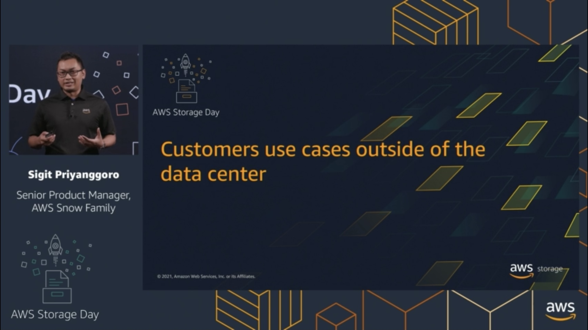

Welcome to the third annual AWS Storage Day 2021! During [Storage Day 2020](https://aws.amazon.com/blogs/aws/welcome-to-aws-storage-day-2020/) and the [first-ever Storage Day 2019](https://aws.amazon.com/blogs/aws/welcome-to-aws-storage-day/) we made many impactful announcements for our customers and this year will be no different. The one-day, free [AWS Storage Day 2021](https://pages.awscloud.com/AWS-Storage-Day-2021.html) virtual event will be hosted on the [AWS channel on Twitch](https://www.twitch.tv/aws). You’ll hear from experts about announcements, leadership insights, and educational content related to [AWS Storage services](https://aws.amazon.com/products/storage/).

I presented live from Seattle on Twitch about "**What our customers are doing with AWS services outside of the data center**". I look a bit more chonky here due to COVID19 weight gain :D

Watch the recorded Twitch stream here: https://www.twitch.tv/videos/1136887952?t=05h22m19s, and YouTube re-upload here: https://www.youtube.com/watch?v=PHonPBZHGFQ 

**Disclaimer**

https://sigit.cloud/disclaimer/

