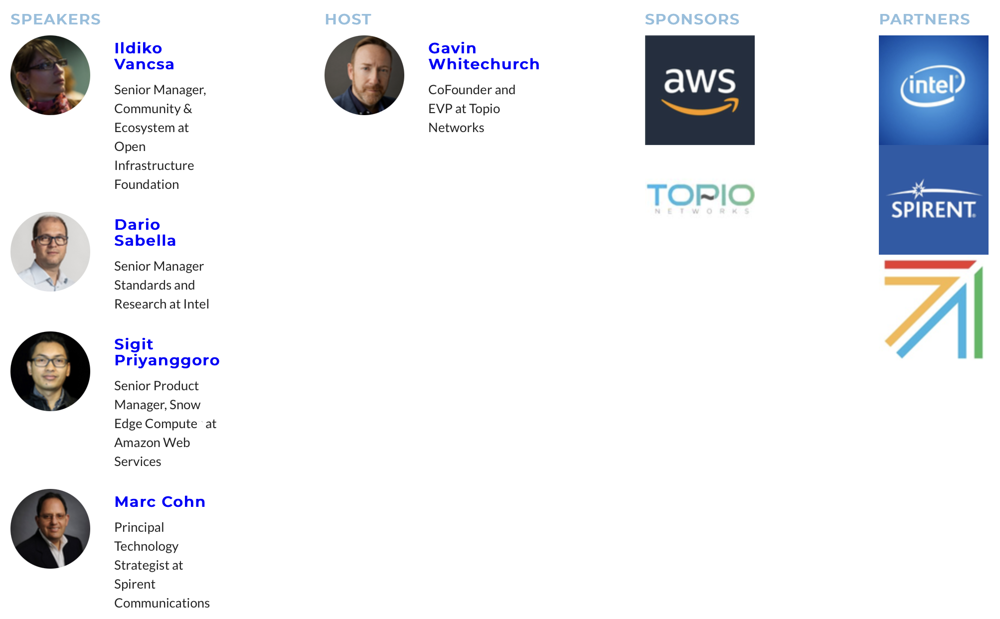

Edge Computing World is the premiere series of events for the Edge Computing space, recognized for bringing together the entire edge market for learning and networking.

Edge Computing World Global in October will bring together over 4000 attendees from end users, ecosystem and developers, and **125+ speakers** in total with a unique collection of edge experiences, case studies & insights.

Edge Computing World has a heavy emphasis on end user case studies, sharing market experience for the benefit of the community. Never before have so many edge end-users been gathered together in a single event to share their views and opinion on the benefits and challenges of deploying edge computing.

I presented together with [**Ildiko Vancsa**](https://www.topionetworks.com/people/ildiko-vancsa-617c2b52105eb55bf2b8cb5c "Ildiko Vancsa"),  [**Dario Sabella**](https://www.topionetworks.com/people/dario-sabella-617ce2161dedae7ec3745ab0 "Dario Sabella"), and [**Marc Cohn**](https://www.topionetworks.com/people/marc-cohn-617d4d1978e00269f3bbd04f "Marc Cohn"), [**Sigit Priyanggoro**](https://www.topionetworks.com/people/sigit-priyanggoro-617cde25105eb54de0b8ca1e "Sigit Priyanggoro").

Watch the recorded session [**here**](https://www.topionetworks.com/events/617acba2949049189f10192e?flow=rw_media_signup#media-617fb808105eb55100b8cb52). 

**Disclaimer**
https://sigit.cloud/disclaimer/