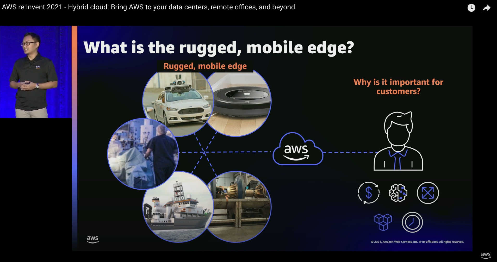

**AWS re:Invent** is a learning conference hosted by Amazon Web Services (AWS) for the global cloud computing community. The in person event features keynote announcements, training and certification opportunities, access to 1,500+ technical sessions, the Expo, after-hours events, and so much more. For 2021, the event took place in **Las Vegas, NV, NOV. 29 – DEC. 3, 2021**.

In my session, I talked about hybrid cloud: Bring AWS to your data centers, remote offices, and beyond. While most applications can be easily migrated to the cloud, some need to be re-architected or “modernized” before they can be moved to the cloud, while others need to remain on premises or in a specific location for the foreseeable future due to low latency, local data processing, or data residency requirements. 

Watch this recorded live session to learn how a hybrid cloud gives you a consistent set of cloud services to support your applications and end users, wherever you need it.

I presented this live session together with **Dr. Daniela Becker**, Senior Product Manager from AWS Storage Gateway team. 

Watch the recorded session [**here**](https://youtu.be/MRK9XfO4J6k).

**Disclaimer**
https://sigit.cloud/disclaimer/